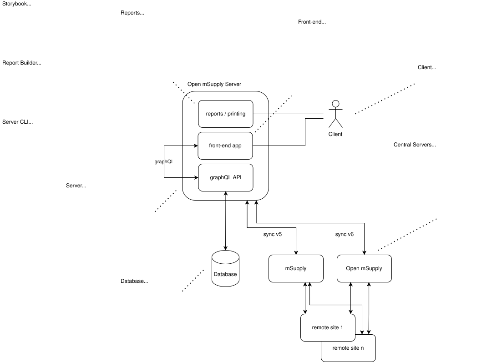

# Open mSupply

> **This repository is a filtered, read-only mirror.** Open mSupply is developed in a private
> monorepo at The mSupply Foundation, and the open-source part of that repo is published here
> automatically. Read [About this mirror](#about-this-mirror) before opening a pull request or
> building anything on top of these branches.

Open mSupply is the open-source version of [mSupply](https://msupply.org.nz/): pharmaceutical
supply chain management and dispensing, from national warehouses to remote clinics, on servers,
laptops and mobile devices. It is in use in over 30 countries.

The code is licensed under the [mSupply Open Source License](LICENSE), a derivative of the
AGPL-3.0.

## What is here

| Directory           | What it is                                                                                                   |
| ------------------- | ------------------------------------------------------------------------------------------------------------ |
| `server/`           | The Rust server: GraphQL API, sync, and either PostgreSQL or SQLite. See [server/README.md](server/README.md) |
| `frontend/`         | The SolidJS web client, the UI going forward. See [frontend/README.md](frontend/README.md)                   |
| `client/`           | The original React web client, also packaged as desktop and Android apps. See [client/README.md](client/README.md) |
| `standard_reports/` | The standard report definitions shipped with the app                                                         |
| `standard_forms/`   | The standard form definitions shipped with the app                                                           |
| `docs/`             | The developer documentation site, published at [dev-docs.msupply.foundation](https://dev-docs.msupply.foundation/) |
| `build/`, `docker/` | Installer and container build scripts                                                                        |

The server hosts the compiled web client and exposes a GraphQL API that the client consumes.
Browsers, the desktop wrapper and the Android app all talk to the same server.

Installers and Android packages for each release are on the
[Releases](https://github.com/msupply-foundation/open-msupply/releases) page.

## About this mirror

- **What is published.** The open-source source tree: server, both clients, docs, standard
  reports and forms, and build scripts. Not published: customer-specific plugins and reports,
  internal design notes and process material, and the CI configuration of the private repo.
  Paths are filtered out of the whole history, not just the current tree.
- **Commit SHAs differ from the private repo.** The mirror rewrites history to apply the filter,
  so a commit here has a different SHA from the same commit internally. Commit messages, authors
  and dates are preserved. References such as `#1234` in commit messages point at issues and pull
  requests in the private repo and will not resolve here.
- **History may be republished.** If the publishing rules change retroactively, for example to
  remove something that should not have been published, the affected branches and tags are
  force-pushed. Every such event is recorded in the [republication log](#republication-log)
  below. A fork that has commits on top of `develop` or `main` will need to rebase after one.
  Feature work in a fork branched from a release tag is the least exposed.
- **The history from before the monorepo** is preserved unchanged on the `pre-monorepo` branch.
  Anything that referenced an old SHA still resolves there.
- **`develop` and `main` are bot-owned.** Nothing is merged into them here. They are updated
  from the private repo at each release and otherwise on demand, so `develop` here is a snapshot
  rather than a live branch.
- **Release tags** of the form `vX.Y.Z` are published. Release-candidate and nightly tags are not.

### Reporting a bug or requesting a feature

Open an [issue](https://github.com/msupply-foundation/open-msupply/issues/new/choose) here, using
the templates. Accepted reports are recreated in the private tracker for the team to work on. The
public issue is linked to that work and closed when the fix reaches this mirror.

### Pull requests

Pull requests are welcome, and they are **reviewed here but not merged here**. Once accepted, a
maintainer imports the commits into the private repo, where they go through the normal CI and
review and merge. The change then flows back out with the next sync, with your authorship
preserved on the commit. Your pull request is closed, not merged, with a comment naming the
commit it landed as.

What to expect:

1. Target the `develop` branch.
2. A maintainer triages the pull request within a working week and labels it `imported`,
   `needs-changes` (with review comments) or `declined` (with a reason).
3. No CI runs on this repo. Please say in the description which checks you ran locally.

See [CONTRIBUTING.md](CONTRIBUTING.md) for the local development setup and the contribution
workflow in full.

## Republication log

Force-pushes of already-published history, newest first. Empty means none since the mirror
started.

| Date | Refs | Reason |
| ---- | ---- | ------ |
| YYYY-MM-DD | `develop`, `main`, all release tags | Cutover to the mirror: `develop` and `main` were replaced with filtered history from the private monorepo, so every commit has a new SHA. The previous public history is preserved unchanged on `pre-monorepo`. |

<!--
  CUTOVER: set the date on the row above to the day of the first sync, and
  merge that change BEFORE dispatching it. The sync publishes this file, so a
  row added afterwards needs a second force-push to appear.

  Adding a row (maintainers): newest first, directly under the header above.

  | 2026-10-21 | `develop`, `main`, all release tags | Filtering rules corrected — a path was removed from the published history. |

  Date    The day of the force-push, YYYY-MM-DD.

  Refs    What was rewritten. Usually every published ref, since they share the
          rewritten history; name a subset only if that is what was dispatched.

  Reason  One line, and the direction matters. When something was REMOVED from
          history, keep it general: this log is public, so naming the file or
          describing its contents re-publishes what the rewrite was meant to
          take back. When something was ADDED to the published set, name it —
          nothing is sensitive in that direction and readers benefit.

  No need to tell readers to rebase, or to link an internal issue: the
  republication bullet under "About this mirror" already covers the first, and
  internal issue numbers do not resolve here.
-->
