Need to:

* Display (item detail view)
* Create configuration
* Assign (item detail view)
* Filter (both present filter option in UI and apply filter in reports and different views)
* Migrate from existing mSupply structure
* Display (list view, as column)
* Align with universal codes server
* Sort (list view, as column) -> very hard, considered, can work but complex

### Shape

```mermaid
erDiagram
    category_level ||--o{ category_level : id--parent_id
    category_level ||--o{ category : id--category_level_id
    item ||--o{ category_item_join : id--item_id
    category ||--o{ category_item_join : id--category_id
    category ||--o{ category_name_join : id--category_id
    name ||--o{ category_name_join : id--name_id
    category_level {
        text id
        text parent_id
        text description
        text name
        domain_type domain
    }
    category {
        text id
        text parent_id
        text category_level_id
        text description
        text name
    }
    category_item_join {
        text category_id
        text item_id
    }
    
    category_item_join {
        text category_id
        text item_id
    }
    name {
        text id
    }
    item {
        text id
    }
    category_name_join {
        text category_id
        text name_id
    }
    domain_type {
        variant item
        variant name
    }
```

### Example

Examples of properties to follow