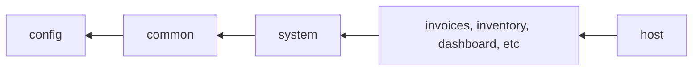

# Open mSupply Client

Welcome! This is the front end application for open mSupply.

This is a multi-lingual, responsive web application making use of the open mSupply [remote-server API](https://github.com/open-msupply/server/README.md).

It is built using React, with typescript, and a heavy reliance on hooks. The component framework is material-ui and we're using [storybook](https://storybook.js.org/) to demonstrate the usage and functionality of custom components.

The test framework is jest; functional areas are separated into packages and managed with [lerna](https://lerna.js.org/)

The API is a GraphQL server and internally we are running a mock server to backfill functionality in the API while that is being developed. The local GraphQL server is running on Apollo and we're making use of a mock service worker to handle specific requests.

To see it in action, check out the [demo server](https://demo-open.msupply.org/) which is running from the current `develop` branch.

## Usage

- Install dependencies (Using node v16+ and using yarn):

`yarn install`

- Run on development mode:

`yarn start` (using demo server as API)

`yarn start-local` (using localhost:8000 as API - ensure you have already gone through the `server` setup instructions)

`yarn start -- -- --env API_HOST='http://localhost:8001'` (using custom API url, see [config.ts for more info](./packages/config/src/config.ts))

- If there are feature flags in use, they are set as environment variables. For example:

`yarn start-local-features FEATURE_INVENTORY_ADJUSTMENTS=true`

- Bundle for production:

`yarn build`

- Test:

`yarn test`

## Development

- `main` branch - is the stable release branch
- `develop` branch - the default, and active, development branch

When developing, create an issue first then a branch based on the issue number. Current practice is to use the format `[issue number]-some-description` for the branch name. When ready, create a PR which targets `develop` and when approved, merge to `develop`. We aim to review PRs promptly and keep the PR list as low as possible as a kindness to other developers ( and reduce merge hell! )

When creating a new component, please create a story in storybook. For functional areas, please add a test or two - just check the current examples of tests and stories to see how things works now.

The directory structure in `client` looks like this:

```
client
├─ node_modules
├─ packages
│  ├─ android
│  │  ├─ app
│  │  │  ├─ build
│  │  │  │  ├─ outputs
│  │  │  │  │  ├─ apk
│  │  │  │  │  │  ├─ debug
│  │  │  │  │  │  └─ release
│  │  │  │  │  └─ ...
│  │  │  │  └─ ...
│  │  │  └─ ...
│  │  └─ ...
│  ├─ common
│  ├─ config
│  ├─ dashboard
│  ├─ electron
│  │  ├─ node_modules
│  │  ├─ out
│  │  │  ├─ make
│  │  │  └─ [platform specific]
│  │  └─ src
│  ├─ host
│  ├─ inventory
│  ├─ invoices
│  ├─ programs
│  ├─ requisitions
│  └─ system
```

The functional areas are in `packages` as noted below. Mostly the packages are similar and standard, with the following exceptions:

- android: which contains the build files for the android app. The directory path for the apk has been expanded, other than this you should only need to run the yarn scripts required to build the app
- common: as the name suggests, contains code common to the other packages. This is the largest bundle and should be fairly static. External packages are imported only into `common` and then re-exported as required, in order to reduce bundle size and the number of dependencies.
- config: has application specific configuration such as routes and the API URL
- electron: the build files for the electron based desktop application. The output folder has been expanded; as with the android app, you should only need to use the yarn scripts to generate the required binaries.
- host: the wrapper for the application which then hosts individual packages. Components in here include the framework - navigation, footer, drawer, app bar - and pages such as login
- system: packages which are re-used by other packages, such as `item` and `name` but are application-specific, which is why they are in here and not in `common` which is trying to be more application agnostic.

Packages should have the following hierarchy:



Packages shouldn't have circular dependencies to other packages, i.e. packages can only import packages on their left (as shown in the diagram).
For example, the `common` packages can be imported by the `system` package but the `common` package can't import the `system` or the `invoices` package.

Code is separated into functional areas, so that we can isolate bundles to these areas. These are not the same as areas in the site; there is a separation between code organisation and UI organisation - for example the site has `Distribution > Outbound Shipments` and `Replenishment > Inbound Shipments` and both of these are found in the `invoices` package in the code, as they are functionally very similar while being logically different.

Within each area you'll see a similar pattern of this for tabular data, which is pretty much everything:

```
.
├── [package name]
│   └── src
│        └── [functional area]
│            ├── DetailView
│            │   ├── api.ts
│            │   ├── DetailView.tsx
│            │   └── [other components]
│            └── ListView
│                ├── api.ts
│                ├── ListView.tsx
│                └── [other components]
├── [package name]
│   └── src
```

Couple of things to note:

- There is a pre-commit hook ( thanks husky ) which will run a typescript compilation and a linter to ensure that your changes will compile
- When you create a PR, there is a GitHub webhook which uses the webpack bundle size analyzer plugin and will create a comment on your PR telling you the size difference introduced by your change
- When merging to `main` there is another webhook which will deploy your change to the demo server (this is currently disabled for the `main` branch, though there is a webhook deploying the `feature/programs` branch)

The default branch is `develop` and any PRs will be merged into this branch, if not working on a specific feature. We retain `main` as a stable release branch. When releasing, the package number is bumped in `client/package.json` and a tag added in the format `v[major].[minor].[patch]` e.g. `v1.0.5` - with release candidate versions supported as `v[major].[minor].[patch]-RC[release candidate number]`.

Standard semver rules apply:

1. MAJOR version when you make incompatible API changes
2. MINOR version when you add functionality in a backwards compatible manner
3. PATCH version when you make backwards compatible bug fixes

## Queries

We're using [React Query](https://react-query.tanstack.com/overview) to query the server and manage a local cache of queries.

Check out the existing implementation using `api.ts` files and integration with the `DataTable` component.

React Query is a higher level package which manages caching and provides useful hooks for implementation. The API communication is using the package `graphql-request`. For this we've implemented a wrapper around `request` within the component `GqlContext` in order to catch gql errors and raise them up to React Query. The api is returning valid (200) responses with an error object when there is an error. React Query is expecting an error to be raised - so the implementation in `GqlContext` is interrogating responses and checking for errors.

When using `useQuery`, caching is handled for you. Provide a cache key as in the example usages here. When using a mutation we typically don't want to cache the response, so no cacheKey is used.

Cache keys are simply an object which is used as a stable reference for the cache. We are using a hierarchy for the cache keys and pass in an array of strings as the actual key. For example, in the outbound shipments, we have a base key of the string `outbound`. For a specific invoice, the cache key consists of the base, the store ID and the invoice ID. If you invalidate the base cache key of 'outbound' then the cache will be cleared for all invoices. To be more targeted, you could invalidate for a specific invoice, or for all invoices in a store.

An example of the pattern of hooks we've implemented when working with api calls is shown below. This is a simplified version of the outbound shipment implementation:

```
api/
├─ hooks/
│  ├─ document/
│  │  ├─ ...
│  │  ├─ index.ts
│  │  ├─ useOutbound.ts
│  ├─ line/
│  │  ├─ index.ts
│  │  ├─ useOutboundLines.ts
│  └─ utils/
│     ├─ index.ts
│     └─ useOutboundApi.ts
├─ api.ts
├─ index.ts
├─ operations.generated.ts
└─ operations.graphql

```

The cache keys are created in `use_____Api.ts`. For example, in `useOutboundApi.ts` there is the following:

```
  const keys = {
    base: () => ['outbound'] as const,
    detail: (id: string) => [...keys.base(), storeId, id] as const,
    list: () => [...keys.base(), storeId, 'list'] as const,
    paramList: (params: ListParams) => [...keys.list(), params] as const,
    sortedList: (sortBy: SortBy<OutboundRowFragment>) =>
      [...keys.list(), sortBy] as const,
  };
```

and you will see the keys being referenced in other hooks, like so:

```
  const api = useOutboundApi();
  useQuery(api.keys.paramList(queryParams), ...
```

where the file `hooks/index.ts` has something like this in it:

```
import { Utils } from './utils';
import { Lines } from './line';
import { Document } from './document';

export const useOutbound = {
  utils: {
    api: Utils.useOutboundApi,
    ...
  },

  document: {
    get: Document.useOutbound,
    ...
  },

  line: {
    stockLines: Lines.useOutboundLines,
    ...
  },
};
```

The queries are implemented in `api.ts`. If you need to modify the shape of the data returned, then the preferred approach is to implement that in the api query. If required, this can also be done in the hook which calls the query, though this isn't idiomatic.

## Localisation

We're using [react-i18next](https://react.i18next.com/) for localisations. Collections of translatable items are grouped into namespaces so that we can reduce bundle sizes and keep files contained to specific areas. The namespace files are json files - kept separate from the main bundles and downloaded on demand. These are also cached locally in the browser.

When using translations in your code, you may need to specify the namespace to use e.g.

```
import { useTranslation } from '@openmsupply-client/common';

...

const t = useTranslation('common');

...
<ModalLabel label={t('label.code')} />
```

You can also specify multiple namespaces when using the hook:

```
  const t = useTranslation(['common', 'distribution']);
```

## Android App

Please see android folder in server and android folder in react for further details, including prerequisite setup steps required for commands below

It's recommended to use Android Studio to run and debug Android App, the following command are available from `client` directory:

```bash
# Builds remote server binaries for android and copies them to android package
yarn android:build:server
# Assembles android apk
yarn android:build:debug
# Assembles android release apk
yarn android:build:release
```

## Desktop App

The client application can be bundled as a desktop app. Currently we're using [Electron](https://www.electronjs.org/) for this. For more details about how this is done, and development, see the [electron README](packages/electron/README.md)
