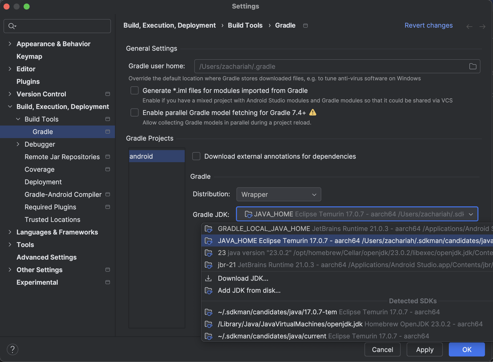

# Mobile App with Discovery

The Android app can run as standalone site with a local server, as a client connecting to another server or as a server for other clients.
On Android, the server always starts on the device.
This makes it possible to have one mobile app for all operational modes.
The mobile app will broadcast via dns sd and will be reachable by both Mobile and Electron clients on the local network.

We are using Capacitor to make use of existing optimisations and large library of native plugins.
The UI is not bundled within Capacitor, it is served by the server the client connects to, but the discovery UI is always served by the bundled local server.

## Building the Rust Server Library for Android

Before building the Android app, the Rust server library that allows us to run the mSupply server on the mobile device needs to be built.

This requires a few steps.

### 1. Install Android Studio

Download and install Android studio (Ladybug at time of writing 15/11/24) (Instructions [here](https://developer.android.com/studio))

### 2. Install NDK in Android Studio

Install NDK (26.1.10909125 at the time of writing on the 8/4/24) (Instructions [here](https://developer.android.com/studio/projects/install-ndk#specific-version))


### 3. Add the required build targets to Rust

Currently we support two Android architectures (32bit and 64bit);

| rust target             | android ABI | Type  |
| ----------------------- | ----------- | ----- |
| aarch64-linux-android   | arm64-v8a   | 64bit |
| armv7-linux-androideabi | armeabi-v7a | 32bit |

To add these targets run:

```bash
rustup target add aarch64-linux-android armv7-linux-androideabi
```

> Note: The linkers Rust uses are defined in `server/android/.cargo/config.toml`, under [target._architecture_].

### 4. Configure the NDK

Now we have to tell Rust where to find the Android NDK binaries required to link the server library. This is done by setting the `NDK_BIN` env variable to the currently installed Android NDK.

For example, to permanently add the `NDK_BIN` env variable on a mac run:

```bash
echo "export NDK_BIN=~/Library/Android/sdk/ndk/26.1.10909125/toolchains/llvm/prebuilt/darwin-x86_64/bin/" >> ~/.zshrc
```

> If you are on linux or using a different version of the NDK for some reason, you'll need to adjust this command accordingly.

Run `source ~/.zshrc` to apply the changes to the current terminal.

Validate that `$NDK_BIN` is set correctly using `ls $NDK_BIN` (this should give a list of files starting with aarch64 and armv7a)

## Java Installation

In your terminal, run `java --version` to check if you have it installed. As at 19/12/2024 version `17.0.7-tem` is tested and works with our setup

We normally use [SDK man](https://sdkman.io/) to manage java versions, this can be installed using the following terminal command:
`curl -s "https://get.sdkman.io" | bash`

Then install Java 17.0.7-tem (Temurin) using the following terminal command:
Install the last tested version of Java: Run `sdk install java 17.0.7-tem`
To make this the default version of Java `sdk default java 17.0.7-tem`.

### Configure Java in Android Studio

Now we'll set up Android Studio so that it will use the version of Java that we want.
First of all, open Android Studio and click Open. Open '<your Open mSupply repository>/client/packages/android'.
Then, when you're in that project, go to Android Studio settings -> Build, Execution, Deployment -> Build Tools -> Gradle.
You should see a dropdown to select 'Default Gradle JDK'.
That dropdown should have an option to use a JDK called '17.0.7-temurin' - select that one.
Here's a screenshot of what that should look like (the sidebar shows you what you should click on to get to this part of the settings):



You may also see prompts in Android Studio to sync - keep an eye out for these and run the sync as needed.

## Building the Server

You can now use `yarn build:server` from the `client/packages/android/` directory, this builds the `libremote_server_lib.so` binaries and relocates them to `app/src/main/jniLibs`.
Please see `client/packages/android/app/src/main/java/org/openmsupply/client/RemoteServer.java` for more details of how these libs are loaded.
It's important to note that web app is bundled in the remote server binary, and web app needs to be built from the `client` directory with `yarn build` command, so it's best to use `yarn android:build:server` from client directory as it does both (builds web app and then build android remote server).

## Scripts

The following (low-level) scripts are available in this directory

```bash
# in the client/packages/android directory:

# Builds remote server binaries for android and copies them to android package
yarn build:server
# Assembles android apk
yarn build:debug
# Assembles android release apk, requires key store information, see below
yarn build:release
# Copies over configurations and other assets
yarn apply-config
# Copies over configurations and other assets for debug build
yarn apply-config:debug
```

As per earlier comment, please make sure to build front end with `yarn build` from client directory prior to runner the above or run `yarn android:{command here}` from client directory to do both with one command.
For this reason it's often easier to run the following scripts in the `client` directory which makes sure everything is built correctly:

```bash
# in the client directory:

# Build the frontend and the server libs
yarn android:build:server
# Build the frontend and assembles the Android debug apks for each architecture
yarn android:build:debug
# Build the frontend and assembles the Android release apks for each architecture
yarn android:build:release
```

Sometimes you may want to build just one apk. The following scripts can be run to build only the Arm64 apk for a smaller file size and quicker build time.

```bash
# in the android directory:

# Build the frontend and assembles the Android debug apks for Arm64 architecture
yarn build:debug && ./gradlew assembleArm64Debug
# Build the frontend and assembles an Android release apk for Arm64 architecture
yarn build:release && ./gradlew assembleArm64Release
```

### Known script issues

When building apk `properties.local` files is required (it can be empty). Also can sometime get a lock on gradle build, can run `find ~/.gradle -type f -name "*.lock" -delete` to fix it

If encountering errors such as "Failed to find tool." Check the `server/android/.cargo/config.toml` file has the correct targets.

## Building APKs

There are two types of apks that can be built locally - Debug and Release. See below sections for each type. Each of these can be built with either architecture compatibility - arm64 or universal

You will find the resulting apks in `client/packages/android/app/build/outputs/apk/`. There will be a folder for each architecture built , and within these a folder for the type generated which contains the apk file.

```
client/packages/android/app/build/
─ outputs/
       └─ apk/
         ├─ arm64/
         │     ├─debug/
         │     │   └─ open-msupply-arm64-debug.apk
         │     └─release/
         │         └─ open-msupply-arm64-release.apk
         └─ universal/
               ├─debug/
               │   └─ open-msupply-universal-debug.apk
               └─release/
                   └─ open-msupply-universal-release.apk

```

### Architectures

We have two apk product flavors configured with Gradle in client/packages/android/app/build.gradle - Arm64 and Universal.

Flavors:
Arm64 flavor runs on 64bit devices only.
Universal flavor contains both 32bit and 64bit architecture, so can be run on either device type. This has a much larger file size.

We have chosen this design to optimise the rollout of new versions - one apk can be downloaded and installed on all devices at a site. If a site doesn't doesn't need 32bit compatibility, the smaller Arm64 file can used.

When creating a build through either `yarn android:build:debug` or `yarn android:build:release`, an apk for each flavor will be created from the one command.

#### How the flavors work

This is the flavor configuration in the build.gradle file:

```flavorDimensions "abi"
productFlavors {
arm64 {
dimension "abi"
applicationIdSuffix ".arm64"
versionNameSuffix "-arm64"
ndk {
abiFilters "arm64-v8a"
}
}
universal {
dimension "abi"
applicationIdSuffix ".universal"
versionNameSuffix "-universal"
ndk {
abiFilters "armeabi-v7a", "arm64-v8a"
}
}
}
```

The ABI (application binary interface) refers to the CPU architecture that the application is built to run on. Each product flavor specifies the target ABI in the ndk configuration. This allows us to build the apk for different device types.

## Debugging with Android Studio

It's recommended to use Android Studio for debugging and running the Android app, because there is a lot of functionality that cannot be replicated in Visual Studio Code (although there are some extensions for Visual Studio Code, they are quite limited).

Run `yarn android:build:server` in the client folder and connect the tablet via USB (check USB debugging is enabled in the tablet settings).

Open a new project in Android Studio with this directory (client/packages/android) - this will engage the gradle sync process (initialising pre-requisites etc.), if you get an error during 'sync' process Android Studio should outline the issue with suggested fix.
Usually you will need to either set `ANDROID_SDK_ROOT` or add `sdk.dir` in `local.properties` file, and skd is usually located in `/Users/{user}/Library/Android/sdk/`. Pressing play (run) should restart sync process.

Debugging native Java code is straight forward, breakpoint in Android Studio and press debug.

Debugging web app code is done by opening `chrome://inspect/#devices`, you should see the Web View when the app is running in emulator - select inspect.

### Debugging with live reload

By default, the bundle is served from the Rust server, which means no hot-reloading, and debugging is difficult due to the JavaScript bundle being minimised.

For development, you can point the APK to the webpack server on your local machine.

In this directory, copy the `capacitor.config.local.example.json` file to `capacitor.config.local.json`. Edit the debug URL to use your IP (note `localhost` will not work with Android, must be IP).

Make sure the frontend is running: `yarn && yarn start` in the `client` directory.

From this directory, you can now either build the debug APK:

```bash
yarn build:debug
```

Or directly apply the new config:

```bash
yarn apply-config:debug
```

You can then run the debug APK on your device or emulator. The app will connect to the webpack server running on your local machine, and you can use live reload for development.

Please note that when debugging with live reload, connections to a discovered server will always go through to the webpack server (regardless of which server is being selected).

It's also a good idea to connect your local chrome browser to emulator or device, by going to chrome://inspect, this is especially helpful when needing to refresh the app, read consoles or inspect network traffic

When running the Android app in an emulator the service discovery will not work outside of the emulator network, to test discovery you will need to run the app on a physical device.

## Testing on Tablet (APK)

To make the an apk that you can install on a device for testing, run `yarn android:build:debug` in the client directory.
You can then transfer it to the tablet and install it. This can be done by uploading the apk file via the android studio device manager, then clicking the apk file from the device itself. Or using [adb](https://developer.android.com/tools/adb)

## Release build

Make sure you have an Android keystore for signing the release apk.
Create a file `local.properties` and add the required key store parameters:

```
storeFile=path/to/key/store.jks
keyAlias={mykey}
storePassword={password}
keyPassword={password}
```

and run:

```
yarn build:release
```

The apks will be located as per file structure above.

It's best to run `yarn android:build:release` from client directory to make sure front end is bundled correctly in the server

There is also a Github Action to build release apks, this is automated when a commit is tagged as a version (tag beginning with v). These apks will be accessible on Github from the Android Build action once the action has completed.

## Adding plugins

Apart from usual local/packaged plugin setup for Capacitor, make sure to add plugin name to `onPageStarted` method in `ExtendedWebViewClient.java` (you can see what plugin names are available by using Android Studio debug and inspecting `bridge.plugins`). See point 2. in Capacitor Modifications (below).

Example of expanding local native functionality (TODO)

## Capacitor Modifications

A few configuration/modifications were made to make sure we can serve Android bundle from the server rather then static bundle with the app (this allows upgrades to server to reflect in the android app when android app is connected as a client to external server, we would still need to upgrade android app when native functionality is added).

1. capacitor.config.ts (see comment in that file)
2. Capacitor `proxies` inject some pre-requisite <scripts> into the target webpage.
   Since the mSupply servers uses self signed certs, fetching the target webpage fails and the pre-requisite scripts are not inserted.
   For this reason `ExtendedWebViewClient` was created to manually inject the required <script> tags.
   [Discussion](https://github.com/ionic-team/capacitor/discussions/6166) was made on capacitor github to see if there is another way to overcome this.
3. Base url is loaded manually in `handleOnStart()` method in `NativeApi.java`

## Extra

The cert plugin (`app/src/main/java/org/openmsupply/client/certplugin/CertPlugin.java`) allows the web client to make https request to the remote-server using a self signed certificate. It needs to extend `ExtendedWebViewClient` rather than `WebViewClient` to allow for Capacitor Modification 2. to work.

`RemoteServer.java` is jni mapping to functions defined in `server/android/src/android.rs`, it is started and stopped in `MainActivity.java`

## CAP

Capacitor comes with cli, we mainly use `npx cap copy` (or `yarn apply-config`), this moves bundled assets to app/src/main/assets/public. Usually capacitor would bundle web app within the APK, since we are serving front end bundle with server we don't need to move them (you will not that in capacitor.config.ts `webDir` is pointed to a non-existant directory). Capacitor also moves pre requisites to cordova plugins to that folder, which is automatically injected into served `html`. Another task of `npx cap copy` is to copy configuration files `capacitor.config.ts` is translated to JSON file and moved to app/src/main/assets

`app/src/main/assets/public` directory is typically not committed, but since it's only going to have cordova artifacts, it is in our case (to reduce setup).

`npx cap copy` or `yarn apply-config` should only be run when cordova plugins are added or updated or when updating capacitor.config.ts

When adding plugins - add them to the android package; if they are not here, then `npx cap sync` does not detect them. You should see

```

✔ Updating Android plugins in 2.09ms
[info] Found 3 Capacitor plugins for android:
@capacitor-community/barcode-scanner@3.0.3
@capacitor/keyboard@4.1.1
[info] Found 1 Cordova plugin for android:
cordova-plugin-printer@0.8.0

```

with the new plugin showing up under the Cordova or Capacitor plugins sections.
Also, add the plugin to `onPageStarted` in `ExtendedWebViewClient` - see the other plugins for details.
If you require the plugin to be used in other packages, then you can also install in the root, or in individual packages, to make it available for use elsewhere.

You can check the plugins using `npx cap ls` or the configuration generally with `npx cap doctor`

If you are having gradle issues, open the project (packages/android folder) in Android Studio and then click on the "Sync Project with Gradle Files" button in the top right of Android Studio (the icon looks like an elephant).

## Self signed cert SSL security

To avoid an error being thrown by the native web view when the server certificate is self-signed, we override the web view certificate error listener and allow connection when:

- In debug mode
- The connection is local after verifying the certificate against the local `cert.pem` file : this is for discovery or when connecting to a local server
  \*The stored SSL fingerprint matches the server fingerprint

For the above to work we store the SSL fingerprint when we first connect to the server and then check that fingerprint on consecutive connections.
The SSL fingerprint is stored in app data and is associated with the `hardwareId` and `port` of the server.
This works very similar to ssh client, but we associate fingerprint with hardwareId and port instead of domain or ip since local ip can change for the server.

App data would need to be cleared if the local certificate was changed.

## Log files on Android

Go to `browse files` in device manager, then navigate to `data/org.openmsupply.client/files/(log_name).log` to view log, logs that have exceeded the max file size is compressed and saved as a `.gz` zip.
Alternatively when using an emulator, navigate to `data/user/0/org.openmsupply.client/files/(log_name).log`.

## Common Android Studio Errors

### Java

If you get a Java Compatibility error in Android studio during Gradle sync, you can download a new JDK via settings/preferences -> Build, Execution, Deployment -> Build Tools -> Gradle -> (drop down Gradle JDK:), and choose the Java version as per [capacitor.build.gradle](https://github.com/openmsupply/open-msupply/blob/7befca66e757570bcec1eacc58099393e8eba8d0/client/packages/android/app/capacitor.build.gradle#L5).
Then sync the Gradle files via the elephant icon on top right (or File -> Sync Project with Gradle Files).

### AGP

If you get AGP compatibility error in Android Studio during gradle sync, you will need to update your Android Studio version.

### Failed to find/build :capacitor

Run `npx cap sync` from android directory
