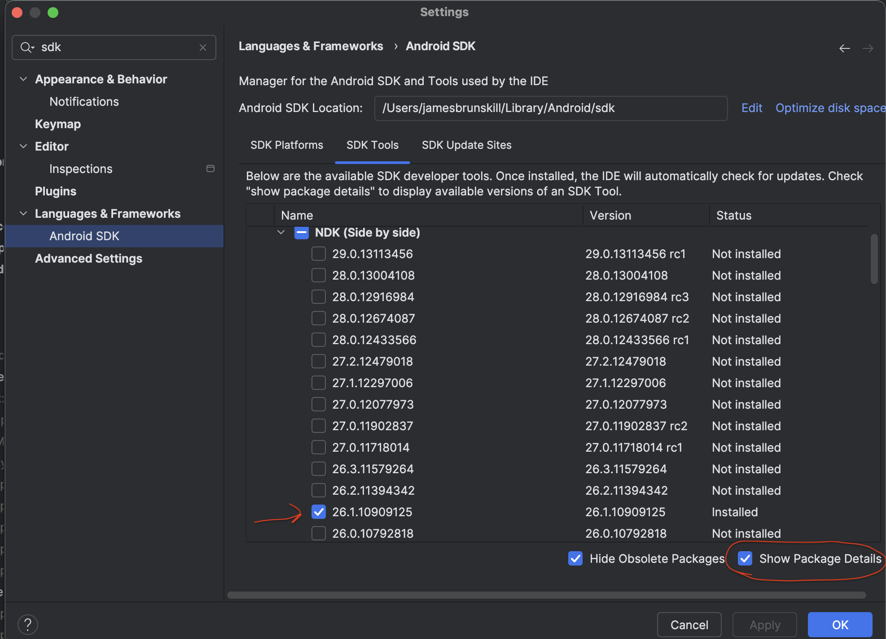

# Mobile App with Discovery

The Android app can run as standalone site with a local server, as a client connecting to another server or as a server for other clients.
On Android, the server always starts on the device.
This makes it possible to have one mobile app for all operational modes.
The mobile app will broadcast via dns sd and will be reachable by both Mobile and Electron clients on the local network.
We are using Capacitor to make use of existing optimisations and large library of native plugins.
The UI is not bundled within Capacitor, it is served by the server the client connect to, and discovery UI is always served by local bundled server.

## Building the Rust Server Library for Android

Before building the Android app, the Rust server library that allows us to run the mSupply server on the mobile device needs to be built.
This requires a couple of steps.

- Install Android Studio
- Install NDK (26.1.10909125 at the time of writing on the 8/4/24)



Currently, we support two Android architectures;

| rust target             | android ABI |
| ----------------------- | ----------- |
| aarch64-linux-android   | arm64-v8a   |
| armv7-linux-androideabi | armeabi-v7a |

To add the required build targets to Rust run:

```bash
rustup target add aarch64-linux-android && rustup target add armv7-linux-androideabi
```

Next we have to tell Rust where to find the Android NDK binaries required to link the server library.
This is done by setting the `NDK_BIN` env variable to the currently installed Android NDK.
For example, to permanently add the `NDK_BIN` env variable do:

```bash
echo "export NDK_BIN=~/Library/Android/sdk/ndk/26.1.10909125/toolchains/llvm/prebuilt/darwin-x86_64/bin/" >> ~/.zshrc
```

Open a new terminal and validate that `$NDK_BIN` is set correctly: `ls $NDK_BIN` (this should give a list of files starting with aarch64 and armv7a)
Note, which linker Rust should use is defined in `server/android/.cargo/config.toml`, under [target.*].

You can now use `yarn build:server` form this directory, this builds the `libremote_server_lib.so` binaries and relocate them to `app/src/main/jniLibs`.
Please see `client/packages/android/app/src/main/java/org/openmsupply/client/RemoteServer.java` for more details of how these libs are loaded.
It's important to note that web app is bundled in the remote server binary, and web app needs to be built from `client` directory with `yarn build` command, so it's best to use `yarn android:build:server` from client directory as it does both (builds web app and then build android remote server).

## Scripts

The following (low-level) scripts are available in this directory

```bash
# in the client/packages/android directory:

# Builds remote server binaries for android and copies them to android package
yarn build:server
# Assembles android apk
yarn build:debug
# Assembles android release apk, requires key store information, see below
yarn build:release
# Copies over configurations and other assets
yarn apply-config
```

As per earlier comment, please make sure to build front end with `yarn build` from client directory prior to runner the above or run `yarn android:{command here}` from client directory to do both with one command.
For this reason it's often easier to run the following scripts in the `client` directory which makes sure everything is built correctly:

```bash
# in the client directory:

# Build the frontend and the server libs
yarn android:build:server
# Build the frontend and assembles an Android debug apk
yarn android:build:debug
# Build the frontend and assembles an Android release apk
yarn android:release
```

### Know script issues

When building apk `properties.local` files is required (it can be empty). Also can sometime get a lock on gradle build, can run `find ~/.gradle -type f -name "*.lock" -delete` to fix it

## Debugging

It's recommended to use Android Studio for debugging and running Android App, there is a lot of functionality that cannot be replicated in Visual Studio Code (although there are some extensions for Visual Studio Code they are quite limited).

Open this directory in Android Studio, this will engage gradle sync process (initialising pre-requisites etc.), if you get an error during 'sync' process Android Studio should outline the issue with suggested fix.
Usually you will need to either set `ANDROID_SDK_ROOT` or add `sdk.dir` in `local.properties` file, and skd is usually located in `/Users/{user}/Library/Android/sdk/`. Pressing play (run) should restart sync process.

Debugging native Java code is straight forward, breakpoint in Android Studio and press debug.

Debugging web app code is done by opening `chrome://inspect`, you should see Web View when app is running in emulator. When bundled is served from remote server (default setup), js bundle is minimised and this makes debugging very hard, however we can run the bundle from webpack server by commenting out plugins section in `capacitor.config.ts` and entering your local ip in the debugUrl field and running `yarn apply-config`. Please make sure that you start front end server with `yarn start-local` from 'client' directory for this to work.

Please note that when debugging with live reload, connections to a discovered server will always go through to the webpack server (regardless of which server is being selected).

When running the Android app in an emulator the service discovery will not work outside of the emulator network, to test discovery you will need to run the app on a physical device.

## Release build

Make sure you have an Android keystore for signing the release apk.
Create a file `local.properties` and add the required key store parameters:

```
storeFile=path/to/key/store.jks
keyAlias={mykey}
storePassword={password}
keyPassword={password}
```

and run:

```
yarn build:release
```

The apk will be located in `app/build/outputs/apk/release`.

It's best to run `yarn android:build:release` from client directory to make sure front end is bundled correctly in the server

## Adding plugins

Apart from usual local/packaged plugin setup for Capacitor, make sure to add plugin name to `onPageStarted` method in `ExtendedWebViewClient.java` (you can see what plugin names are available by using Android Studio debug and inspecting `bridge.plugins`). See point 2. in Capacitor Modifications (below).

Example of expanding local native functionality (TODO)

## Capacitor Modifications

A few configuration/modifications were made to make sure we can serve Android bundle from the server rather then static bundle with the app (this allows upgrades to server to reflect in the android app when android app is connected as a client to external server, we would still need to upgrade android app when native functionality is added).

1. capacitor.config.ts (see comment in that file)
2. Capacitor `proxies` inject some pre-requisite <scripts> into the target webpage.
   Since the mSupply servers uses self signed certs, fetching the target webpage fails and the pre-requisite scripts are not inserted.
   For this reason `ExtendedWebViewClient` was created to manually inject the required <script> tags.
   [Discussion](https://github.com/ionic-team/capacitor/discussions/6166) was made on capacitor github to see if there is another way to overcome this.
3. Base url is loaded manually in `handleOnStart()` method in `NativeApi.java`

## Extra

The cert plugin (`app/src/main/java/org/openmsupply/client/certplugin/CertPlugin.java`) allows the web client to make https request to the remote-server using a self signed certificate. It needs to extend `ExtendedWebViewClient` rather than `WebViewClient` to allow for Capacitor Modification 2. to work.

`RemoteServer.java` is jni mapping to functions defined in `server/android/src/android.rs`, it is started and stopped in `MainActivity.java`

## CAP

Capacitor comes with cli, we mainly use `npx cap copy` (or `yarn apply-config`), this moves bundled assets to app/src/main/assets/public. Usually capacitor would bundle web app within the APK, since we are serving front end bundle with server we don't need to move them (you will not that in capacitor.config.ts `webDir` is pointed to a non-existant directory). Capacitor also moves pre requisites to cordova plugins to that folder, which is automatically injected into served `html`. Another task of `npx cap copy` is to copy configuration files `capacitor.config.ts` is translated to JSON file and moved to app/src/main/assets

`app/src/main/assets/public` directory is typically not committed, but since it's only going to have cordova artifacts, it is in our case (to reduce setup).

`npx cap copy` or `yarn apply-config` should only be run when cordova plugins are added or updated or when updating capacitor.config.ts

When adding plugins - add them to the android package; if they are not here, then `npx cap sync` does not detect them. You should see

```
✔ Updating Android plugins in 2.09ms
[info] Found 3 Capacitor plugins for android:
       @capacitor-community/barcode-scanner@3.0.3
       @capacitor/keyboard@4.1.1
       @capacitor/preferences@4.0.2
[info] Found 1 Cordova plugin for android:
       cordova-plugin-printer@0.8.0
```

with the new plugin showing up under the Cordova or Capacitor plugins sections.
Also, add the plugin to `onPageStarted` in `ExtendedWebViewClient` - see the other plugins for details.
If you require the plugin to be used in other packages, then you can also install in the root, or in individual packages, to make it available for use elsewhere.

You can check the plugins using `npx cap ls` or the configuration generally with `npx cap doctor`

If you are having gradle issues, open the project (packages/android folder) in Android Studio and then click on the "Sync Project with Gradle Files" button in the top right of Android Studio (the icon looks like an elephant).

## Self signed cert SSL security

To avoid an error being thrown by the native web view when the server certificate is self-signed, we override the web view certificate error listener and allow connection when:

- In debug mode
- The connection is local after verifying the certificate against the local `cert.pem` file : this is for discovery or when connecting to a local server
  \*The stored SSL fingerprint matches the server fingerprint

For the above to work we store the SSL fingerprint when we first connect to the server and then check that fingerprint on consecutive connections.
The SSL fingerprint is stored in app data and is associated with the `hardwareId` and `port` of the server.
This works very similar to ssh client, but we associate fingerprint with hardwareId and port instead of domain or ip since local ip can change for the server.

App data would need to be cleared if the local certificate was changed.

## Log files on Android

Go to `browse files` in device manager, then navigate to `data/org.openmsupply.client/files/(log_name).log` to view log, logs that have exceeded the max file size is compressed and saved as a `.gz` zip.
Alternatively when using an emulator, navigate to `data/user/0/org.openmsupply.client/files/(log_name).log`.

## Common Android Studio Errors

### Java

If you get a Java Compatibility error in Android studio during Gradle sync, you can download a new JDK via settings/preferences -> Build, Execution, Deployment -> Build Tools -> Gradle -> (drop down Gradle JDK:), and choose the Java version as per [capacitor.build.gradle](https://github.com/openmsupply/open-msupply/blob/7befca66e757570bcec1eacc58099393e8eba8d0/client/packages/android/app/capacitor.build.gradle#L5). Then sync Gradle files vai elephant icon on top right or File -> Sync Project with Gradle Files.

### AGP

If you get AGP compatibility error in Android Studio during gradle sync, you will need to update your Android Studio version.

### Failed to find/build :capacitor

Run `npx cap sync` from android directory
