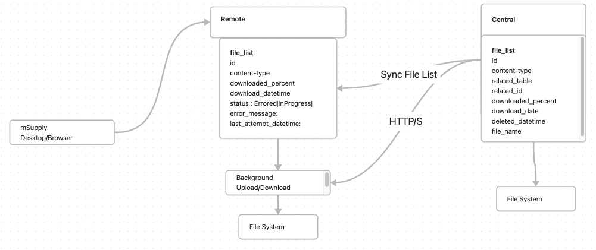

# File Sync

- _Date_: 2024-02-28
- _Deciders_: James Brunskill, Mark Prins, Andrei Evguenov, Chris Petty
- _Status_: DECIDED (almost)
- _Outcome_: Option 1

## Context

Our cold chain equipment management features require a mechanism to upload and download documents, and images related to assets.

If these were to go via our standard sync process, large files would potentially block the sync process, slow down deployments to sites, etc.

All options assume we'll use the open-mSupply Central Server Sync process recently established.
This means that file sync will only work for open-mSupply Installations.

## Options

### Option 1 - Sync File IDs via std process, and download/upload files in a separate process

Since we already have a process which allows for syncing data, controlling which records go to which sites, etc, we can reuse this process, to send a list of file ID to each site. Once the file ID is know the server can kick off a background process to download the file to the site via HTTP. If a file hasn't been downloaded yet, but is requested by the client, the server could download the file immediately and cache the result. (This could have some obvious challenges with files that are already halfway downloaded, connection issues, etc.)

One key advantage of this approach is that we should be able to store partially downloaded (and uploaded) files and continue from where they're left off rather than having the whole sync request fail.

We can also put in additional logic such as suspending file sync while the main sync is in progress, rate limiting, etc.

It is assumed that we won't do anything special to compress files in MVP.
A similar process can be implemented for uploading files using [TUS](tus.io)

_Pros:_

- Keeps the main sync process simple/unchanged
- Allows for targeted logic for file syncing (e.g rate limiting in future)
- Allows for files to be downloaded where they're needed rather than needing to sync everywhere (via std sync process)

_Cons:_

- We could end up writing quite a bit of code to implement this and may have unexpected challenges with the implementation
- Other sync protocols might provide benefits e.g. rsync for example uses a delta transfer algorithm which only sends the differences between files, rather than the whole file.

### Option 2 - Base64 encode files and use std sync

Any files needed to be synced could be base64 encoded and sent as part of the normal sync process. This would be a simiplish process, but would mean that sync would be blocked until all files are fully downloaded. Base64 encoding would also increase the size of the file by 33% (or more) which could be a problem for large files.

This option is probably only viable if we built in some kind of sync record prioritisation, which would make the process more complex.

_Pros:_

- Simple to implement (if we ignore the sync record prioritisation bit)

_Cons:_

- Sync would be blocked until all files are fully downloaded
- Base64 encoding would increase the size of the file by 33% (or more)

### Option 3 - Use a third party file sync process

A tool such as [https://syncthing.net/](https://syncthing.net/) or even dropbox, could be setup on every installation to sync files. This would be a simple process, but would mean that we'd need to setup and maintain a third party tool on every installation. This would save us development effort on creating our own file sync process.

_Pros:_

- Not much to develop, but there's still complexities around what files are available, how do we communicate this to the client?
- Syncthing is a peer to peer protocol, so concievably we could sync files between installations without needing to go via the central server. (unlikely in practice, but possible)

_Cons:_

- How would this work with Android? Can dropbox even be accessed from our code base?
- We'd need to setup and maintain a third party tool on every installation, even if the time taken for this is acceptable, the risk of miss configurations, missed steps in configuration, etc is high.
- We probably wouldn't have a lot of control over which files go where, which might cause problems with disk usage, espeically on smaller devices.
- There could be data privacy issues raised with a third party tool, could data be exposed via a third party server. (Risk can be mitigated in selection of the service, or customer agreement with what service to use)

### Option 4 - Only store files on central server and query central directly for files when needed

Would be the simpliest solution, but wouldn't meet our offline first goals

### Option 5 - Custom implementation of an existing sync protocol

https://github.com/abusch/st-rust perhaps? It's explicitly marked as a `Toy` implementation though.
If there's a good candidate someone knows of, we could consider this.

## Decision

We will use Option 1, Sync File IDs via std process, and download/upload files in a separate process.
This will allow to mostly leave our normal sync process as it is, and although it will require significant development, it's relatively simple to understand and maintain.

## Consequences

Files will need to be given an id, the file itself should never change once uploaded. If a file needs to be replaced, it will need a separate ID...

Files will need to be backed up separately to the datafile for the server.
