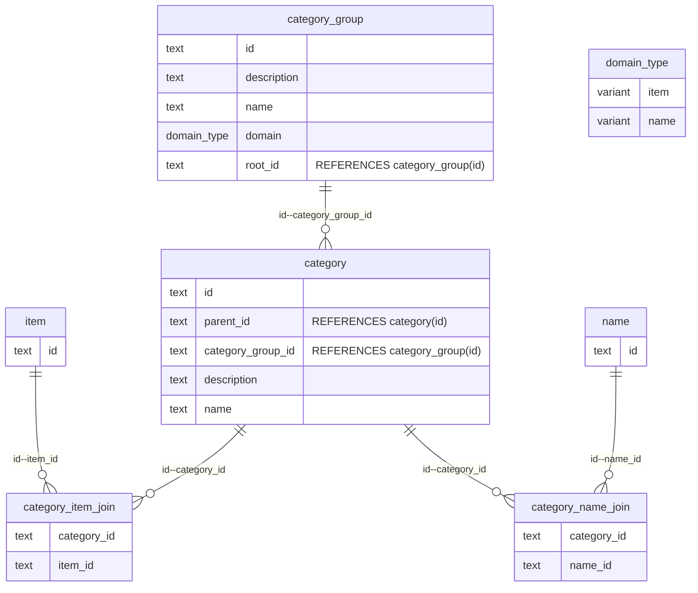

# Categorisation in Open mSupply

- _Date_: 2024-11-12
- _Deciders_: @andreievg, @lache-melvin, @mark-prins, @jmbrunskill
- _Status_: DECIDED
- _Outcome_: Translate legacy `item_category` to `category` for now, implement OMS category management interface in future

## Context

Item categories exist in legacy mSupply but not yet in Open mSupply. We now need to be able to filter items by category, so it's time to decide whether we port across existing categories or start with a new model.

### Additional info

Categories have been a bit of a rubbing point in legacy mSupply - they're optimised for reporting, with fixed 3 tiers of categorisation rather than an extendable hierarchy. It's also a bit confusing, `category1` having the hierarchy, and then `category2` and `category3` existing separately as non-hierarchical categorisations. We want to improve the usability of categories in Open mSupply.

## Options

### Option 1 - New categorisation system in OMS

New categorisation system in OMS, with a `category` table that can be linked to any domain type (e.g. `item`, `name`, etc). It can allow as many levels of hierarchy as needed, making it more flexible for future requirements. Also introduces a `category_group` table (or maybe `category_tag`?) to allow easier filtering.

Design from Andrei, considering we need to:

- Display (item detail view)
- Create configuration
- Assign (item detail view)
- Filter (both present filter option in UI and apply filter in reports and different views)
- Migrate from existing mSupply structure
- Display (list view, as column)
- Align with universal codes server
- Sort (list view, as column) -> very hard, considered, can work but complex

### Shape

Depending on needs, its possible that category_group -> category might want to be a many to many relationship, but that does add more complexity.

_Pros:_

- More flexible for future requirements
- No dependency on legacy mSupply categories

_Cons:_

- A lot of work to implement:
  - Need a central server UI for creating/managing categories
  - And UI to set the category for each item
  - The new tables would be v6 central data, need to be stored and synced to remote sites
- Bit of complexity - do we need it all, at least now?
- Need to consider how to port existing categories when legacy mSupply is migrated (or decision to abandon them and start fresh)

### Option 2 - Bring across categories from Legacy mSupply

Let's just translate the categories as they are.

_Pros:_

- Quick to implement
- Easy for existing mSupply sites to migrate their categories to Open mSupply

_Cons:_

- Only allows for 3 tiers of categorisation
- Optimised for reporting rather than considering all categorisation use cases
- Only for items, can't be mapped to other domain types

### Option 3 - Create the `category` table now, but manage them in legacy mSupply

Create the `category` table now, but translate categories from legacy `item_category`. This allows us to move quickly to get categorisation in place in OMS, while still allowing for the flexibility of the new pattern in the future.

We can ignore `category_group`for now - this is probably only needed when we have more complex querying requirements or when we want to be able to configure multiple mode of categorisation (e.g. national categorisation system, Universal Codes..)

> The client that needs item categorisation right now isn't currently using item categories in legacy mSupply, so setting up legacy categories to work with OMS will be fine for them. However, if another client comes along who needs a different kind of categorisation in OMS than they already have set up in legacy, we'll need to build the UI for managing categories in OMS at that point.

_Pros:_

- Don't need to build the UI for managing categories yet (faster)
- Lay foundation for new categorisation system in the future

_Cons:_

- We need to make time to finish the job later
  - This could be an urgent request depending on deployment timelines

## Decision

We will go with Option 3 - create the `category` table now, but translate categories from legacy `item_category`. We have limited budget for now, and this allows us to move quickly to get categorisation in place in OMS, while still allowing for the flexibility of the new pattern in the future.
