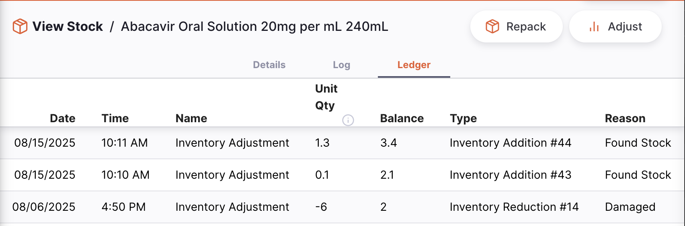
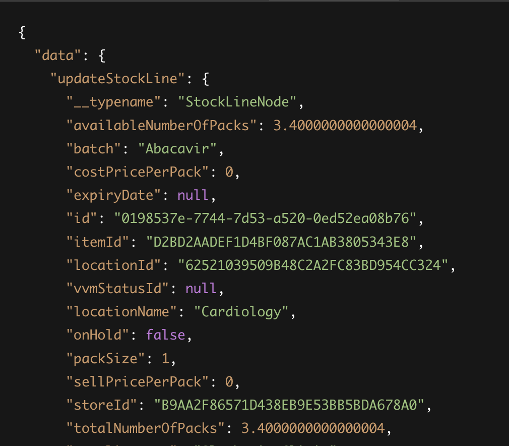
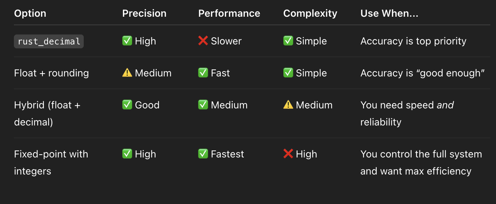

# Handling Floating Point Precision in Stock Calculations

- _Date_: 2025-08-15
- _Deciders_:
- _Status_: DRAFT
- _Outcome_: Pending

## Context

Our system is a stock management system, and a key part of this is ensuring accurate representation of stock quantities for the users.

For some background, floating point numbers are used to represent quantities of packs as decided previously in [decimal_pack_size](./2024-04-15_decimal_pack_size). The goal here is not to discuss the previous decision, but rather to determine how to accurately represent the numbers moving forward.

In many places, the UI is rounded to show numbers at 2 decimal places. This improves the user experience. However underlying inaccuracies still exist and affect calculations.

Note: This is written specifically in regards to stock quantity calculations, though it's worth bearing in mind that these inaccuracies likely also occur with price and volume calculations.

### Use cases

Stock has several layers of measurement:

- Packs
- Units in a pack
- Doses per unit (vaccines)

Calculations involving any of these units alone or in combination can result in floating point errors due to precision limits, particularly where partial packs are involved. This includes:

- Inventory adjustments
- Stocktakes
- Dispensing
  - Prescriptions
  - Encounters
- Viewing the item/stock line

These calculations can result in minor but compounding errors due to floating point limitations.

Example use cases:

- Floating point inaccuracies that occur as a result of calculations with numbers stored as f64:
  2.1 packs of a stock item are on hand. An Inventory adjustment is done to increase packs by 1.3.
  Expected result: 3.4 packs.
  Actual result: 3.400000000004 packs.

- Accurate decimals from fractional transactions:
  A vaccine has 3 doses per unit. Starting with 5 units, 3 doses are issued.
  Expected result: 4 units / 12 doses.
  Actual result: 4 units / 11.9999999999999999 doses.

### Detailed Example

An issue raised recently which resulted from floating point inaccuracies: https://github.com/msupply-foundation/open-msupply/issues/8471

There have been many changes in the stocktakes area since this occurred in version 8.4.2, so I am showing a similar scenario in inventory adjustments.

Starting with a balance of 2.1 packs, I do an inventory adjustment to add 1.3 packs. The resulting packs appear as expected - a balance of 3.4 packs is shown.



However, the stockline is actually saved in the database with 3.400000000004 packs available. This can compound over multiple transactions, gradually increasing or decreasing the amount and leaving the user with unexpected stock variances.



In addition, because many DB viewers round values in the UI, these errors may not be immediately visible to developers, testers, or support staff.

### Considerations

There are many places where stock calculations can be used, on both the client and server side. A solution should:

- Store values in the database using the existing f64 type.
- Provide consistent, predictable decimal values to align with user expectations.
  - Display these values predictably.
- Be intuitive and have a clear pattern for developers to implement efficiently.
- Minimise cumulative floating point and rounding errors.

There may be existing stock lines with floating point errors already - a solution should also handle this, rather than assuming data is initially 'clean'.

One of the advantages of f64 is performance speed, so any alternative should balance this potential impact with the benefits of the solution.

## Options

### Option 1 - Use Decimal for calculating stock values

Preventative Approach

Use helper functions for critical functions - this could look like calculating packs to units or doses and vice versa, or adding/reducing stockline quantities. These helper functions will also convert to or from f64 for saving to the database.

This would take a combined client and server side approach so that what the user sees is accurate to what is saved.

#### Client side:

A lot of this is already in place - rounding (either to 0 or 2dp) is implemented in most number inputs or displays.

We already use helpers with rounding:

```ts
packsToDoses: (
  numPacks: number,
  line: { packSize: number; dosesPerUnit?: number }
) => {
  return NumUtils.round(numPacks * line.packSize * (line.dosesPerUnit || 1));
};
```

This is spread out and could be consolidated, or even integrated with existing Intl functions for a more consistent and reusable approach.

There are packages eg Decimal.js, Big.js that also have helpers and converters, however we already have written a lot of our own custom utils for displaying numbers.

#### Server side:

Using a decimal library such as [rust_decimal](https://docs.rs/rust_decimal/latest/rust_decimal/) can help us handle calculations in a way that a user expects. Example functions for conversion could be:

```rs
use num_traits::ToPrimitive;
use rust_decimal::{prelude::FromPrimitive, Decimal};

fn f64_to_decimal(f: f64) -> Decimal {
Decimal::from_f64(f).unwrap_or(Decimal::ZERO)
}

fn decimal_to_f64(d: Decimal) -> f64 {
d.to_f64().unwrap_or(0.0)
}
```

And then using it in a stock calculation like:

```rs
// Adds two Decimal values and returns the result as a cleaned f64.
fn add_new_stock_to_existing_stock(existing: Decimal, introduced: Decimal) -> f64 {
let total = existing + introduced;
// Convert to f64 for storage
decimal_to_f64(total).unwrap_or(0.0)
}
```

Using a hybrid decimal approach can also improve accuracy with calculations like vaccine doses:

```rs
pub fn dose_amount(doses_per_unit: u32) -> Option<Decimal> {
    if doses_per_unit == 0 {
        None
    } else {
        Some(Decimal::from_u32(1).unwrap()Decimal::from_u32(doses_per_unit).unwrap())
    }
}
```

This precisely represents 1/3 in decimal — unlike in f64, where 1.0 / 3.0 is 0.3333333333333333.

Steps:

- Identify areas where stock has calculations. This is currently present in migrations, repository layer, and service layer.
- Assess if some can be consolidated or moved to the service layer.
- Create helper functions to handle the conversions and calculations.
- Implement the helpers in the identified areas.
- Update types where affected.

_Pros:_

- Accuracy of stock calculations _before_ the data is saved to the database.
- Avoid floating point and recurring decimal errors that may compound over time.
- Provides a consistent and trustworthy user experience.
- Can be applied to the most critical calculations, does not need to be implemented where unnecessary.
- Can expand into cost or volume calculations as/where necessary.

_Cons:_

- Considerable refactoring especially server side, including updating types where values are now in Decimal.
  - Refactored stock in/stock out should help with this.
- Decimal may have performance concerns with large or complex calculations. Rust_decimal is ~5–20× slower than f64 (source - chatgpt), but only needed in critical paths.
- Added complexity by handling two number types.

### Option 2 - Clean Function - User Initiated

Reactive Approach

Run a 'clean' function to pick up on any floating point errors in the database and correct them. This could be triggered in the Settings UI or as part of a stocktake, potentially with a user permission.

Logs could also be generated for support or debugging purposes.

```rs
fn clean(quantity: f64) -> f64 {
    let rounded = (quantity * 1e10).round() / 1e10;
    if (quantity - rounded).abs() > 1e-10 {
        rounded
    } else {
        quantity
    }
}
```

```rs
fn clean_all_stock_lines(stock_lines: &mut Vec<StockLine>) {
for line in stock_lines.iter_mut() {
let new_qty = clean(line.quantity);
if new_qty != line.quantity {
line.quantity = new_qty;
}
}
}
```

_Pros:_

- User controlled - users decide when to apply corrections.
- Relatively simple to implement with minimal changes to code.
- Can be used in addition to other solutions (eg option 3).

_Cons:_

- Requires the user to perform the action to clean their data - risk of this not occurring.
- Overhead: Testing, documentation, user training and support.
- Could determine a value as already 'clean' if errors have compounded enough.
- Does not correct any errors that come from calculations after a database query with valid data - eg pack_size x num_packs = units. This can produce errors on calculation; units cannot be cleaned as it is not stored data.

#### Option 3 - Scheduled Clean Function

Reactive Approach

As above using a clean function, however run automatically on a schedule. Can run periodically (weekly?) in the background with no user input.

_Pros:_

- Automated: Runs on an expected schedule.
- Consistently cleaned data -> reduced likelihood of errors to compound over time.

_Cons:_

- May have performance impacts when processing large batches of data.
- Users may not expect values to be changing or may be attempting to use the stock at the same time.
- Not all stores may need this (eg a central warehouse likely only uses whole packs and won't need cleaning). Decisions around which stores are cleaned will be required.
- Does not correct any errors that come from calculations after a database query with valid data - eg pack_size x num_packs = units. This can produce errors on calculation; units cannot be cleaned as it is not stored data.

### Option 4 - Use Floating Point Math only (no changes)

With most UI handling already in place, these errors often aren't visible to the user even when they exist in data, however, can compound silently behind the scenes.

_Pros:_

- Fast performance with floating point numbers only.
- Less complex code and no type conversions.

_Cons:_

- Floating point errors accumulate and compound over time causing stock inaccuracies.
- Current front end implementations are duplicated and at times unclear when different rounding functions should be used and why.
- UI preventions only mask the underlying problem.
- Is viewed as a 'bug' to users if the stock is not calculating as expected.

### Industry Recommendations

I searched for industry recommendations, however very few suggestions were found as to how to actually handle and prevent floating point errors in a system using f64 where precision is needed.
Some other suggestions from AI tools were to use manual rounding in Rust, or fixed-point with integers (requires scaling all values to a multiplier eg 1000).

A small summary:


## Decision

- TBD

### Consequences
