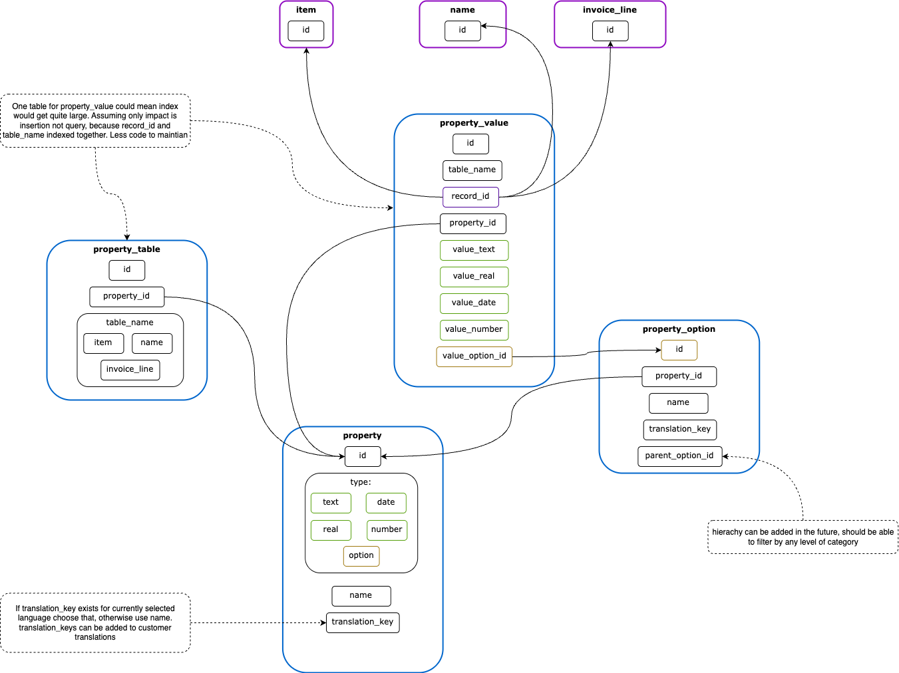
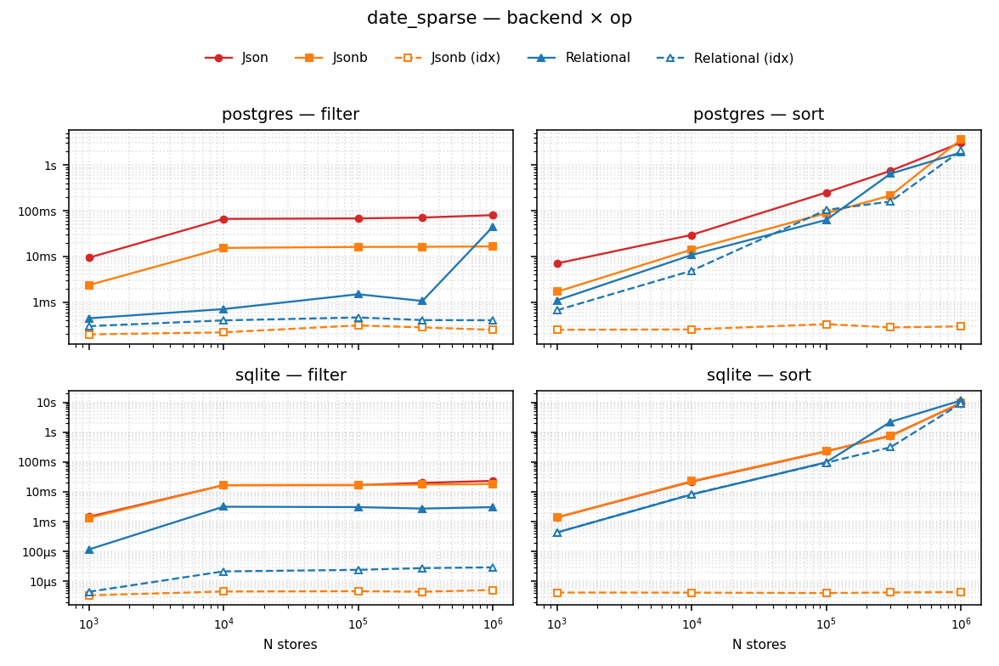
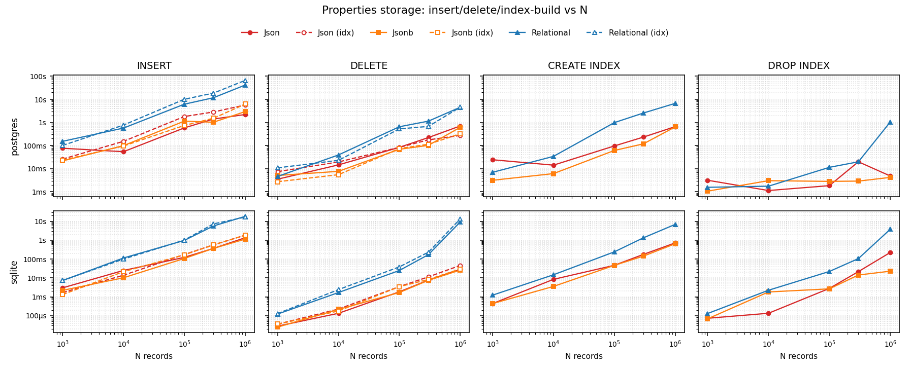
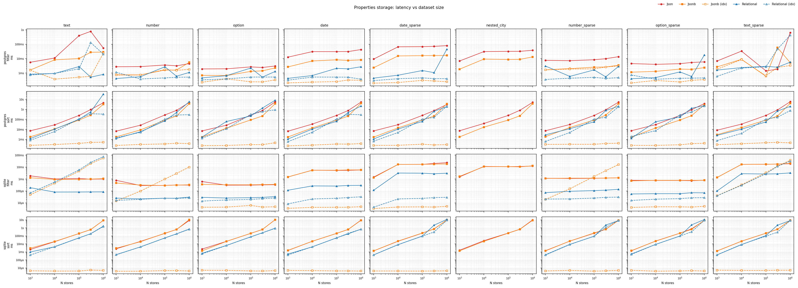

# Properties in Open mSupply

- _Date_: 2026-06-23
- _Deciders_: @jmbrunskill, @ria8651, @andreievg
- _Status_: DECIDED
- _Outcome_: Option 2 - JSON

## Context

Open mSupply should be extendable with user configurable and enterable fields.

### Requirements

1. User can configure a new property:
- **Type:** Can be one of `Text`, `Integer`, `Real`, `Date`, `Boolean`, or `Option` (user-defined categories/options).
- **Name:** Can be specified by the user.
- **Translation:** Can be provided; defaults to a translation if available for the current language, otherwise uses the general name.
- **Table Assignment:** Tables that will have this property can be specified; properties may be reused across multiple tables.
- **Hierarchical Options:** Options can be hierarchical (e.g., item categories in mSupply or organisation units in DHIS2).
- **Advance Type Validation:** A way to restrict entry further then by type/option, like regex, external API lookup. Could be plugin (to be confirmed but good idea to have a way forward for this), similar for updating/displaying property

2. User is able to update the value of the properties. All properties should be clearable and should conform to the rules defined/configured for that property, such as type or particular option linked to property

3. User can change property configurations, however migrations are too difficult to implement and maintain, it's well communicated that updates to configurations (like removing options or changing option type) will not update existing value property values

4. User will see properties in all of the views and lists relating to the data object which the property is linked to. For example an item property will be shown in the item detail view alongside standard item fields, and is available to be shown in tables and lists which show items.

5. User will be able to filter by properties, in the natural option for the property type
- Natural here suggests consistency with existing filters and aligning with expectation of how this property type should be filtered (for option type being able to filter by 'contains' might not be possible because the field might be translated, however would be possible if it's by general name)
6. User can sort a table by a property set for that table
7. User can configure and use properties at a particular store/site only (to be confirmed)
8. A subset of mSupply custom properties (set to be decided) will be visible in Open mSupply. These properties will not be configurable in Open mSupply but will be visible and editable where applicable

There is also a requirement from customisation/plugin end to extend existing records for display/logic, we can feed two birds with one scone having plugins and customisations also using properties, configuration/property setting and display UI for free. 

## Options

### Option 1 - Relational

As per below diagram.

Considerations for performance:

- Can apply broad indexes across the whole `property_value` table
- Harder to create ideal indexes - more indirection through joins

Considerations for sync:

- More complex then JSON, need to track and lookup attached records to know where to sync to
- Handles Requirement 8 well if we choose to tackle that

### Option 2 - JSON

Using JSON structures to store properties rather then a table. This would require the whole record to be synced. With a targeted index and binary JSON columns (in both PostgreSQL and SQLite) this can achieve same or better performance than Option 1 while being conceptually simpler.

<!-- Also adding property configuration functionality to omSupply is slightly easier with "Option 1", however syncing properties attached to remote records is slightly harder (although properties for remote records would only be syncable with V7) -->

Considerations for performance (based on results from `9583-properties-kdd-prototype-feature-sync` - see [Appendix](#appendix---performance-testing)):

- Whenever parsing json in DB (for sorting/filtering) use binary JSON columns - there's no downside
- Slower than Relational but not by a crazy amount - even with 60 properties per row
- With a targeted index for a particular property achieves better performance than relational

Considerations for sync:

- Slots into existing model cleanly (already have examples of synced json categories/properties in codebase), just follows along with attached row
- More data sent per update - no row partial updates in sync
- Will require filtering/merging on sync if we want to tackle Requirement 8

### Option 3 - Split Relational

Have table specific property and/or property_value tables. The idea is to build for future performance and reduce dynamic structure (usually safer and more readable/disoverable). However a pattern like Option 1 would be very common and well understood, negating any effects this abstraction should have on readability/discoverability. As for performance, there is an assumption to be validated that a table_name index together with record_id index on Option 1 will be any slower than separate tables on insert time (for index building), or query (query is the the performance concern, not insert).

### Option 4 - Isn't this just Option 2?...

Store value as JSON rather than different typed fields. This would be easier in general but if we need to do any calculations, it would be slower. Also if configuration is changed for the property it would require higher cognitive load and likely translations (to make sure existing values work)

### Option 5 - Isn't this just Option 2?...

Instead of options, extend and use category table, see KDD, although it wasn't implemented yet to support full and extendable system, there is foundation for it (or change category to be properties) -> Combining properties with categories would be worth it if we consolidate all 'custom/dynamic' configurations, we have too many now:

item categories
asset categories/class
name properties
any other ?

## Further consideration

Performance testing for Option 1 and 2 was done based on filtering then sorting and paginating. This differers to what a dashboard query would do where it would want all the rows matching the query for aggregation and statistics - not paginated.

Reports - We can be quite generic with properties for most things, having generic filter/display in tables etc.. However in reports it would be hard to be generic with properties, especially at the time of display. Similar for report filters. 

Multiple values - Do we need an array type element when multiple values can be associated for the same property ? This sounds more like tags, which is also something generic that should exist in OMS central

Sort - It should be possible but a lot more complex, especially for hierarchical and for options that are translated

Sync - Normally, property, property_table and property_options are central data. property_values is also central data, where table_name = central, otherwise it's remote data and it would sync to a site where property_value.record_id belongs to (can just lookup changelog for record_id). If 7. is validated, we can add store_id to all tables in the diagram and only sync to that site (and only show in that site)

Plugin data / Customisations - When used in custom data and customisation we should populate (create) the property when plugin is installed, and possibly migrate it 

When new core logic is added that relies table field data, I would suggest this to be in a concrete field rather then re-purposing properties, as this is much easier to discover, find and reason about.

How to configure mSupply properties to migrate? For the case of properties that are simply transmitted along with the record like custom 1/2/3 on name:
- Hard coded list of supported mSupply properties in the row structs?
- Load all fields on sync message into hash map and map dynamically to properties based on `legacy_field_name`?
- Add mSupply properties to properties table through migrations?
- Allow adding mSupply properties through GUI?

mSupply properties backfill?
- Probably don't want to reintegrate
- Complex backfill migration?
- Add empty/0/false properties to OMS json?
- Display or hide properties set to empty/0/false?

OMS legacy properties migration?
- Use the same column?
- Leave for later? (Keep same tables and graphql so that existing frontend + plugins + sync unchanged - do new system as properties v2)

[Thoughts on sync implementation](https://github.com/msupply-foundation/open-msupply/blob/078958fec1557c51a2d7ddd5561df1057a396221/docs/content/server/service/properties/_index.md)

## Decision

**Option 2 - JSON**

Store property values as binary JSON (JSONB in PostgreSQL, binary JSON in SQLite) on the owning record, rather than in a separate relational `property_value` table.

Rationale:

- Slots into the existing sync model cleanly — the codebase already syncs JSON categories/properties, and values travel along with their attached row, avoiding the separate record-tracking/lookup that Option 1 requires.
- Conceptually simpler and more discoverable than the relational graph in Option 1.
- Performance is competitive: with binary JSON columns and a targeted index per filtered/sorted property it matches or beats the relational approach, and is only modestly slower in the general case even at ~60 properties per row (see Appendix).
- Options 4 and 5 collapse into this approach.

Trade-offs accepted:

- More data sent per sync update — JSON has no per-field partial updates, so the whole record syncs on any property change.
- Requirement 8 (surfacing a subset of legacy mSupply custom properties) needs explicit filter/merge logic on sync; Option 1 would have handled this more naturally.

## Consequences

- Filtering/sorting on a property in the DB must go through binary JSON columns, and hot paths need a targeted (expression) index on the specific property.
- We accept that the whole record will sync on any property update — JSON has no per-field partial updates, so a property change re-syncs the entire owning record (unless a property-specific sync mechanism is added in future).
- Open questions in "Further consideration" remain to be resolved before/while implementing — notably the mSupply property migration & backfill strategy (Requirement 8) and whether per-store/site scoping (Requirement 7) is in scope.

## Appendix - Performance testing

Benchmarks from `9583-properties-kdd-prototype-feature-sync` (scripts in `server/scripts/`), timing raw SQL against synthetic data on both Postgres and SQLite. Three storage strategies are compared — **Json** (text blob), **Jsonb** (binary-JSON column), and **Relational** (Option 1: one `property_v2_value` row per value) — plus dashed **(idx)** variants where a targeted index exists for the queried property.

### How to read these graphs

- **X axis is dataset size** (number of records, 1k → 1M). Both axes are log, so each gridline is 10×; lower and flatter is better.
- **Each line is one storage strategy.**
- On the **read** charts (filter & sort), **each dot is how long a single query takes** — fetching one page (the first 50 matching rows) at that dataset size. A line at ~10ms over 1k rows and ~100ms over 1M rows means that query gets ~10× slower as the table grows.
- On the **insert / delete** chart, **each dot is the total time to do the whole operation on all N records at once** (one bulk statement) — *not* a per-record average. Solid vs dashed is the same write without vs with the extra index, so the gap between them is what the index costs to maintain.

### What they show

- **Reads** — un-indexed Json/Jsonb get slower as the table grows (every query parses every row's blob); Relational and any indexed path stay low and roughly flat. With a targeted index, Jsonb matches or beats Relational.
- **Writes** — Relational is consistently slowest, because each record becomes 1 `name` row + 4 value rows (plus baseline indexes). Adding the index barely changes insert/delete time.

Full matrix — every property type × backend × operation (<code>perf_scale_log.png</code>)

Caveats: raw-SQL timing excludes app/GraphQL overhead; numbers are warm-cache best case; the **(idx)** lines assume an index per queried property (unrealistic for arbitrary ad-hoc filtering); and the Relational **sort** uses a `LEFT JOIN` rewrite, not the correlated subquery the server's current `apply_property_v2_sort` uses (which the index does *not* help).

