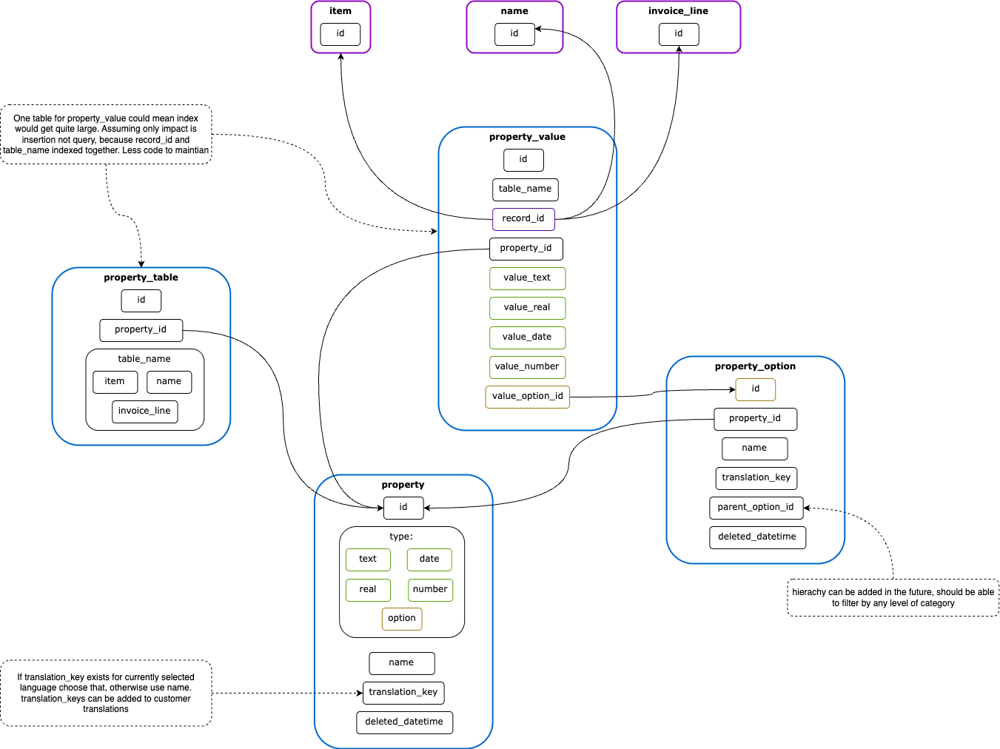

# Properties in Open mSupply

- _Date_: 
- _Deciders_: 
- _Status_:  
- _Outcome_: 

## Context

Open mSupply should be extendable with user configurable and enterable fields.

### Requirements

1. User can configure a new property:
- **Type:** Can be one of `Number (int)`, `Text`, `Date`, `Real (Float)`, or `Option` (user-defined categories/options).
- **Name:** Can be specified by the user.
- **Translation:** Can be provided; defaults to a translation if available for the current language, otherwise uses the general name.
- **Hierarchical Options:** Options can be hierarchical (e.g., item categories in mSupply or organisation units in DHIS2) — to be confirmed.
- **Table Assignment:** Tables that will have this property can be specified; properties may be reused across multiple tables (to be confirmed).
- **Advance Type Validation:** A way to restrict entry further then by type/option, like regex, external API lookup. Could be plugin (to be confirmed but good idea to have a way forward for this), similar for updating/displaying property

2. User is able to update the value of the properties. All properties should be clearable and should conform to the rules defined/configured for that property, such as type or particular option linked to property

3. User can change property configurations, however migrations are too difficult to implement and maintain, it's well communicated that updates to configurations (like removing options or changing option type) will not update existing value property values

4. User will see properties in all of the views and lists relating to the data object which the property is linked to. For example an item property will be shown in the item detail view alongside standard item fields, and is available to be shown in tables and lists which show items.

5. User will be able to filter by properties, in the natural option for the property type
- Natural here suggests consistency with existing filters and aligning with expectation of how this property type should be filtered (for option type being able to filter by 'contains' might not be possible because the field might be translated, however would be possible if it's by general name)
6. User can sort a table by a property set for that table
7. User can configure and use properties at a particular store/site only (to be confirmed)
8. TODO migrations from mSupply (transaction categories etc..)

There is also a requirement from customisation/plugin end to extend existing records for display/logic, we can feed two birds with one scone having plugins and customisations also using properties, configuration/property setting and display UI for free. 

## Options

### Option 1

As per below diagram.

### Option 2

Using JSON structures to store properties rather then a table. This would be harder to sort and filter and would require the whole record to be synced. 

Also adding property configuration functionality to omSupply is slightly easier with "Option 1", however syncing properties attached to remote records is slightly harder (although properties for remote records would only be syncable with V7)

### Option 3

Have table specific property and/or property_value tables. The idea is to build for future performance in mind and reduce dynamic structured (usually safer and more readable/disoverable). However a pattern like would be very common and well understood, negating any effects this abstraction should have on readability/discoverability. As for performance, there is an assumption to be validated that table_name index together with record_id index will only speed up insert time (for index building), not query (query is the the performance concern, not insert), this goes in favour of "Option 1".

### Option 4

Store value as JSON rather than different typed fields. This would be easier in general but if we need to do any calculations, it would be slower. Also if configuration is changed for the property it would require higher cognitive load and likely translations (to make sure existing values work)

### Option 5

Instead of options, extend and use category table, see KDD, although it wasn't implemented yet to support full and extendable system, there is foundation for it (or change category to be properties) -> Combining properties with categories would be worth it if we consolidate all 'custom/dynamic' configurations, we have too many now:

item categories
asset categories/class
name properties
any other ?

## Further consideration

Reports - We can be quite generic with properties for most things, having generic filter/display in tables etc.. However in reports it would be hard to be generic with properties, especially at the time of display. Similar for report filters. 

Multiple values - Do we need an array type element when multiple values can be associated for the same property ? This sounds more like tags, which is also something generic that should exist in OMS central

Sort - It should be possible but a lot more complex, especially for hierarchical and for options that are translated

Sync - Normally, property, property_table and property_options are central data. property_values is also central data, where table_name = central, otherwise it's remote data and it would sync to a site where property_value.record_id belongs to (can just lookup changelog for record_id). If 7. is validated, we can add store_id to all tables in the diagram and only sync to that site (and only show in that site)

Plugin data / Customisations - When used in custom data and customisation we should populate (create) the property when plugin is installed, and possibly migrate it 

When new core logic is added that relies table field data, I would suggest this to be in a concrete field rather then re-purposing properties, as this is much easier to discover, find and reason about.

### Consequences