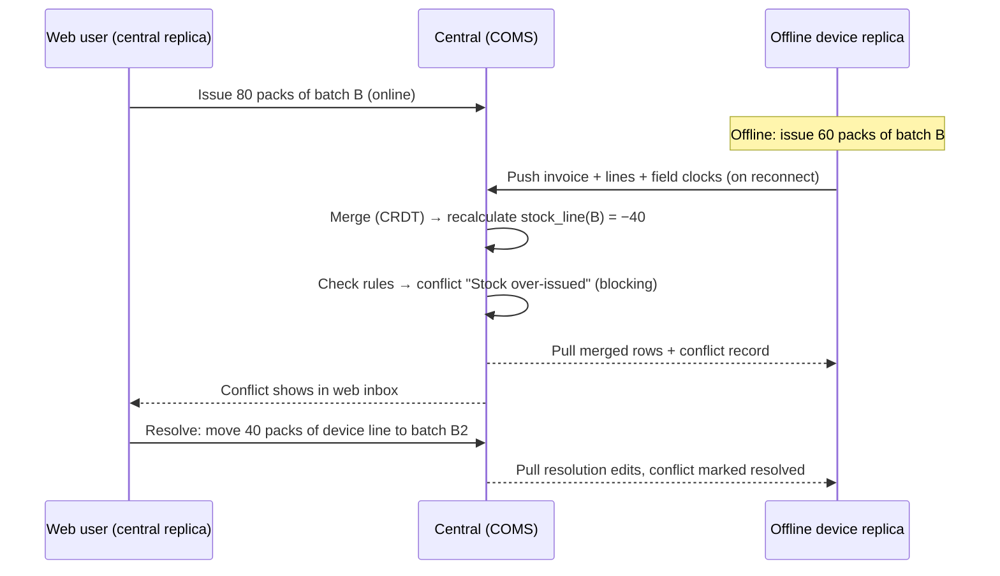

# CRDT-style sync for stores used both online (web) and offline (device)

- _Date_: 2026-09-24
- _Deciders_: TBD
- _Status_: DRAFT — plan for discussion, no code
- _Outcome_: Proposed. Replicated stores with field-level CRDT merge, stock quantities worked out from the ledger, and a conflict inbox where users resolve conflicts (see [Recommendation](#recommendation))

## Contents

1. [Goal](#goal)
2. [How sync works today and why it blocks this](#how-sync-works-today-and-why-it-blocks-this)
3. [What a CRDT can and cannot do here](#what-a-crdt-can-and-cannot-do-here)
4. [Options considered](#options-considered)
5. [Recommendation](#recommendation)
6. [Design](#design)
   1. [Replicas, hybrid stores and identity](#61-replicas-hybrid-stores-and-identity)
   2. [Clocks and merge metadata](#62-clocks-and-merge-metadata)
   3. [Merge rule for each type of data](#63-merge-rule-for-each-type-of-data)
   4. [Stock quantities come from the ledger](#64-stock-quantities-come-from-the-ledger)
   5. [Side effects with fixed ids](#65-side-effects-with-fixed-ids)
   6. [Document numbers](#66-document-numbers)
   7. [Routing, checks and login](#67-routing-checks-and-login)
   8. [Processors](#68-processors)
   9. [Where merging happens](#69-where-merging-happens)
   10. [Detecting conflicts](#610-detecting-conflicts)
   11. [Resolving conflicts](#611-resolving-conflicts)
   12. [Switching between web and offline](#612-switching-between-web-and-offline)
7. [List of conflicts](#list-of-conflicts)
8. [Phased delivery](#phased-delivery)
9. [Testing](#testing)
10. [Risks and open questions](#risks-and-open-questions)

---

## Goal

A user should be able to work with **the same store** in two ways:

- **Online** in a browser, against the central server (COMS). This is "online-only mode", where the store runs on central.
- **Offline** on a local device such as an Android tablet or laptop running the embedded server. Here the store keeps working without internet.

They should be able to switch between the two, or use both at once (office staff on the web, a store-room device offline), without losing data.

Some edits will clash. The motivating example: **someone on the offline device issues stock that an online user has already issued.** When the two histories meet, the system must:

1. Keep **every** record from both sides. Nothing is silently dropped.
2. End up with the **same state on every copy** of the store.
3. Spot where business rules are broken (negative stock, lines added to an invoice that is already shipped, and so on).
4. Show those problems to a user, who **decides** how to resolve them. The decision then syncs like any other edit.

## How sync works today and why it blocks this

V7 sync is hub-and-spoke. It is built on the assumption that **each store has exactly one writer: the site it is active on.** Everything that blocks this goal comes from that assumption.

| Current behaviour | Where | Why it blocks a store with two writers |
|---|---|---|
| A store is active on exactly one site (`store.site_id`) | `service/src/sync/mod.rs` (`ActiveStoresOnSite`) | Central and a device cannot both own a store. |
| Stock, invoice, requisition and stocktake tables are `RemoteOwned`. Central sends them back to the site only while it is initialising, and after that the remote **rejects** them (`SiteAlreadyInitialised`) | `sync_style.rs`, `sync_v7/validate.rs` | Edits made on central would never reach the device. |
| Integration upserts the whole row, so whichever arrived last wins. Older buffered rows for the same record are dropped (`superseded_cursors`) | `sync_v7/validate_translate_integrate.rs`, `diesel_macros.rs` `_upsert` | Concurrent edits to *different fields* overwrite each other. Nothing is flagged. |
| `stock_line.available_number_of_packs` and `total_number_of_packs` are **absolute values** that each mutation reads, adjusts and writes back | `invoice_line/stock_out_line/*`, `invoice/common.rs` | Two sites taking 80 and 60 from 100 give 20 or 40 depending on which arrives last. They should give −40. The double issue is hidden, and this is the motivating example. |
| Status changes cause **side effects** (stock goes down on Picked, stock lines are created on Received) | `invoice/stock_effect.rs`, `inbound_shipment/update/generate.rs` | If both sides make the same change, both apply the side effect: stock is reduced twice, or duplicate stock lines are created. |
| Document numbers come from the `number` table, which is local and not synced. `invoice_number` is not unique | `service/src/number.rs`, `number_row.rs` | Both sides hand out the same invoice, requisition and stocktake numbers. |
| Transfer processors create inbound shipments and response requisitions wherever the store is active | `processors/transfer/*` | Two active copies would each create duplicate transfers. |
| Login on central only offers central's own stores | `service/src/login.rs`, `user_account.rs` | Web users cannot open the device's store. |
| Rows carry no version or modified time. `changelog.is_sync_update` exists but nothing uses it | `changelog.rs` | There is no metadata a merge could use. |
| Finalising a stocktake requires `total_number_of_packs == snapshot` | `stocktake_line/validate.rs` | The check is only reliable within one site. |

Two pieces of existing work help:

- **Multi-device sites** (`docs/content/docs/sync/multi-device`). One site id is shared by several devices. The echo guard (`source_site_id != site_id`) is dropped so each device's edits relay to the others, and those tables use `Remote` style (sent on every cycle). This is exactly the relay pattern we need, but it only covers an allowlist of cold-chain tables. Stock and ordering data are excluded because nothing merges them.
- **`document` rows** already keep a version history with `parent_ids`. They are close to a CRDT already.

## What a CRDT can and cannot do here

A CRDT (conflict-free replicated data type) guarantees **convergence**: every copy that has seen the same set of changes ends up in the same state, whatever order the changes arrived in. It does **not** guarantee **business rules** such as "stock ≥ 0", "nobody edits a shipped invoice" or "numbers are unique". No merge function can guarantee those without coordination. That is a proven limit (the CAP theorem, and invariant confluence in the research literature), not something missing from the design.

So the plan has two layers:

1. **Convergence layer (CRDT).** A merge rule for every field that is deterministic, commutative, associative and idempotent. It never loses a write and never needs a person.
2. **Rule-checking layer (conflicts).** After each merge, the store's business rules are checked. Any breach becomes a **conflict record** that syncs like other data and is resolved by a person through ordinary, auditable edits.

This matches how the problem looks to users. The double-issue example is not really a data-structure problem: two real-world events happened (or were intended), and a person has to decide which reflects reality.

## Options considered

| Option | Summary | Pros | Cons |
|---|---|---|---|
| **A. Checkout / lease** | One writer at a time. The device "checks out" the store, which makes it read-only on the web, and checks it back in later. | No conflicts. Needs only small changes to sync. | You must be online to hand over, but connectivity usually drops without warning. A lost or broken device leaves the store locked. Office and store-room cannot both work. |
| **B. Off-the-shelf CRDT library** (cr-sqlite, Automerge, Yjs) | Adopt a library. | Merge logic is already proven. | cr-sqlite only supports SQLite, but central runs Postgres. Automerge and Yjs are document models and do not fit Diesel or relational views. Neither handles business rules, the ledger or side effects. We would still need both layers above. |
| **C. Sync operations, replay on central** | Sync user intents ("issue 20 packs of batch X to Y") instead of row states. Central replays them in order and the device rebases. | Clear meaning for each action, and rules are checked at replay. | Very large change: every mutation becomes a serialisable command. It breaks the changelog and sync-buffer architecture V7 has just delivered, and requires rebase and undo on devices. |
| **D. State-based CRDT on the current V7 pipeline, plus a conflict layer** | Add replica ids, clocks and merge rules to the existing changelog, sync buffer and integration steps. Work out stock quantities from the ledger. Check rules after each merge. | Reuses V7 routing, cursors, sync buffer, `sync_request` and the multi-device relay. Can be rolled out one table and one store at a time. | Significant work on merge rules for each table. Needs every side effect to use fixed ids. |

## Recommendation

**Option D**, with an optional **soft lease** borrowed from A to *reduce* conflicts, not to prevent them (see [§6.12](#612-switching-between-web-and-offline)). Only stores explicitly configured as **hybrid stores** are affected. Every other store keeps today's single-writer behaviour, so the blast radius stays small.

---

## Design

### 6.1 Replicas, hybrid stores and identity

- **Replica.** Anything that writes to a store's data. Central is one replica. Each device is another.
  - Today a multi-device site shares one `site_id` across devices and cannot tell them apart. Add a **`replica_id`**: a small integer issued by central when a device first logs in and stored in `key_value_store`.
  - `site_id` still decides routing. `replica_id` is used for clock tie-breaks, echo suppression and audit ("edited on Device 3 by Jane").
- **Hybrid store.** A store with more than one writing replica. Configured under Manage → Sites/Stores. Proposed model:
  - The store's home is a V7 site (possibly a multi-device site). The store is additionally marked `is_hybrid`, and **central is an extra writing replica** for it.
  - It could be stored as a join table `store_replica (store_id, site_id, role)`. This avoids overloading `store.site_id` and leaves room for more than two replicas later.
- **Changelog and sync records** get a `source_replica_id` next to `source_site_id`.
  - The echo guard for hybrid-store rows becomes `source_replica_id != requesting_replica_id`. This is a generalised version of the multi-device rule.

### 6.2 Clocks and merge metadata

- **Hybrid Logical Clock (HLC).** Each replica keeps one. It combines physical time, a logical counter and the `replica_id` into a timestamp that is totally ordered and consistent with cause and effect, even when device clocks are wrong. This matters because tablet clocks in the field are often wrong.
  - Central rejects, or clamps and logs, any timestamp more than a set drift (for example 24 hours) ahead of its own clock. This stops one bad tablet from "winning" every future edit.
  - The clock advances on every local write and every merge.
- **Field clocks.** For each row of a hybrid store in a CRDT-managed table, keep the HLC of the last write to each field.
  - Recommended storage: a side table `crdt_row_meta (table_name, record_id, field_clocks JSON, deleted_hlc, created_hlc)`, rather than new columns on every table. This keeps repository row structs unchanged and keeps the extra data out of non-hybrid stores.
  - The repository layer writes it where the changelog is written today. That is the single choke point every mutation already passes through.
- **The sync record carries `field_clocks`** alongside `data`. It can be added as an optional field, so a V7 peer without it keeps working.
- **Fields changed.** Each local write records which fields actually changed. The repository compares against the current row inside the same transaction. Only those fields get a new clock. Without this, a full-row upsert would bump every field and turn field-level merging back into whole-row "last arrival wins".

### 6.3 Merge rule for each type of data

Every hybrid-eligible table is classified in code, next to `sync_style.rs`, as a `MergeStyle`, with a field-level override where needed. The classification is authoritative, tests enforce it, and it is documented the same way sync styles are.

| Merge style | Rule | Typical tables and fields | Can it cause a conflict? |
|---|---|---|---|
| **Insert-only set** | Rows are never updated after insert. Merging = union by id. | `activity_log`, `temperature_log`, `vvm_status_log`, `location_movement`, `asset_log`, `sync_file_reference` | No |
| **Field-level last-writer-wins** | For each field, keep the value with the highest HLC (replica_id breaks ties). | Invoice header text (comment, their reference, colour, transport ref), stock line location, note, on_hold, price, expiry, location and asset fields | Advisory only, when both sides changed the *same* field in the same sync window (see below) |
| **Status that only moves forward** | Statuses are ordered in a lattice. Merging takes the *furthest* status plus the earliest datetime for each status. | `invoice.status` (New < Allocated < Picked < Shipped < Delivered < Received < Verified), `requisition.status`, `stocktake.status` | Yes, when one side cancelled and the other moved forward, or when rules are broken because of the resulting status |
| **Tombstone** | A delete records `deleted_hlc`. If an edit exists with a higher HLC than the delete, that is an edit/delete conflict, not a silent choice. | `invoice_line`, `requisition_line`, `stocktake_line`, draft invoices | Yes |
| **Calculated (not merged)** | The field is never synced as truth. Every replica recalculates it after merging. | `stock_line.available_number_of_packs`, `total_number_of_packs`, `total_volume` | Not directly. Rule checks on the result raise conflicts ([§6.4](#64-stock-quantities-come-from-the-ledger)) |
| **Parent-linked versions** | Keep the existing `parent_ids` history. Two sibling heads mean a divergent edit. Merge JSON field by field; if the same path was changed on both sides, raise a conflict. | `document` (patient and program data) | Yes |
| **Single-writer** | The table stays owned by one replica: central, for hybrid stores. | Transfer-generated records, number allocation, anything processors write ([§6.8](#68-processors)) | No |

**"Same field changed on both sides"** is detected when two concurrent values arrive for one field: neither HLC was seen by the other replica, i.e. the incoming clock is not causally after the local one. Recommended behaviour: the highest HLC wins automatically, and an **advisory** conflict ("Comment changed on both web and Device 2 — web version kept") is recorded so the user can reverse it. This needs a per-row "last seen HLC from each replica" (a small version vector) in `crdt_row_meta`.

### 6.4 Stock quantities come from the ledger

This is the key change for the motivating example.

- **Invoice lines already work as the ledger.** The `invoice_line_stock_movement`, `stock_movement` and `stock_line_ledger` views already derive each stock line's history from invoice lines and their invoice status. `available` is `total` minus lines on New or Allocated invoices (as the ledger-discrepancy view already encodes).
- **For hybrid stores, `stock_line` quantity fields become calculated.**
  - After integration, and after any local mutation that touches a stock line, recalculate `total` and `available` from the lines and the merged invoice statuses. This happens inside the same transaction, but only for the stock lines touched in the batch.
  - The changelog still records the stock line so screens and reports see the new value. Merging ignores the incoming quantity values.
- **Existing mutation code stays mostly as is.** Services can keep their read-adjust-write code. For hybrid stores the repository (or a post-mutation hook) replaces the result with the recalculated value. This limits churn and keeps one source of truth.
- **Making quantities additive makes them converge.** Concurrent issues of 80 and 60 from 100 produce two invoice lines, both kept. Every replica calculates `100 − 80 − 60 = −40`. The negative balance is **a rule breach and becomes a conflict** ([§6.10](#610-detecting-conflicts)).
- **Before a store can be switched to hybrid, its ledger must be clean.** The existing `ledger_fix` discrepancy finder must report zero discrepancies for the store (or they must be fixed first). Otherwise the first recalculation will "move" stock.

### 6.5 Side effects with fixed ids

Any record *created as a side effect* must get an id **calculated from its cause**. Then two replicas that both apply the same change create the *same* row, and it merges as a no-op instead of a duplicate.

- Stock lines created when an inbound shipment is received: `id = uuid_v5(namespace, invoice_line_id)`.
- Reversal lines created when a prescription is cancelled, repack output lines, stocktake adjustment invoices and lines: derive the id from the source record id plus a purpose tag.
- VVM status logs written from stock-out lines: derive from `(invoice_line_id, vvm_status_id)`.

Work needed: audit every `uuid()` call in `service/src/invoice*`, `stocktake*`, `repack`, `stock_line`, `requisition*` and `vvm*`, and list which ones are side effects (they need fixed ids) and which are user-created (random is fine).

### 6.6 Document numbers

Offline, two replicas cannot agree on "the next number". Options:

| Option | Behaviour | Verdict |
|---|---|---|
| **Numbers leased from central in blocks** | Central hands each replica a block (for example 50 invoice numbers) per `(store, number type)`, stored in the `number` table with a range. The device tops up whenever it syncs. | **Recommended.** Numbers stay short, printable and unique. |
| Replica prefix | For example `D3-1024`. | Fallback when a block runs out offline. Unique, but breaks numeric sorting and reports. |
| Temporary number, finalised later | A draft number is shown until sync assigns the real one. | Rejected. Invoices get printed and handed over while offline. |

Also add a **uniqueness check** on `(store_id, type, number)` for hybrid stores during rule checking. A clash means a bug or a block that was issued twice, so it should raise a conflict.

### 6.7 Routing, checks and login

- **Distribution.** For hybrid stores, tables that are `RemoteOwned` today behave like `Remote`: they are sent back on every cycle, relayed by replica, echo-suppressed by `source_replica_id`. This could be a new distribution value, `Replicated`, chosen per store by the changelog filter (`store_id IN hybrid_stores_for_site`), so non-hybrid stores are untouched.
- **Checks.**
  - Relax `SiteAlreadyInitialised` / `InactiveStore` on remotes, and `StoreNotActiveOnSourceSite` on central, but *only* for hybrid stores where the source replica is registered in `store_replica`.
  - Keep a backstop: reject any row for a hybrid store from a replica that is not registered.
- **Multi-device allowlist.** Hybrid-store tables need `multi_device_site`-style treatment. Either widen the allowlist when the site's stores are hybrid, or make the allowlist depend on the merge style. Tables without a merge style must never become multi-writer.
- **Login on central.** `find_user_active_on_this_site` also offers hybrid stores to users with permission. The store picker marks them, for example "Main Store (also used offline on Store-room tablet)".
- **Service-layer guard (new).** Today nothing in services stops a mutation on a store that is not active on this site. Add an explicit check: this replica may write to this store. Hybrid support must not accidentally let *every* remote store be edited from central.

### 6.8 Processors

Processors must run **exactly once per event**, not once per replica.

- **Transfer processors** (invoice and requisition): for hybrid stores, only the **designated processor replica** runs them, which is central. Central is always online and always sees both sides' data. Transfers need connectivity anyway, so waiting for the device to sync costs nothing.
- **Number assignment** (`assign_requisition_number`, and prescriptions once re-enabled): uses leased blocks ([§6.6](#66-document-numbers)). Central assigns numbers for records central processes.
- **Requisition auto-finalise, support uploads, plugin processors:** each processor gets a "runs on" policy: `EveryReplica`, `ProcessorReplica` or `Origin`. The default for hybrid stores is `ProcessorReplica`.
- **Records in a blocking conflict are skipped** by transfer processors ([§6.10](#610-detecting-conflicts)). For example, an outbound shipment in a double-issue conflict does not create the customer's inbound shipment until it is resolved, unless the conflict type's policy says otherwise.

### 6.9 Where merging happens

- **Every replica runs the same merge function.** The results must be identical, and property tests will enforce this.
- **Only central checks rules and creates conflict records.** Central is the hub and sees every replica's changes first, so each conflict is raised once. Devices then receive the conflict records through normal sync.
- **Devices still run rule checks locally, as a preview only.** A device can warn "this may conflict when you sync" without creating records.
- **Integration flow for a hybrid-store batch** (still inside the atomic sync-buffer transaction):
  1. Order by the integration order, as today.
  2. Merge each incoming row with its local row, field by field, using the field clocks.
  3. Write the merged row and metadata. If the merged row differs from what the sender had, write a changelog row stamped with the *merging* replica so the merged result flows back out.
  4. Recalculate the affected stock-line quantities.
  5. Run the rule checks for the touched records, and upsert or close conflict records.

### 6.10 Detecting conflicts

- **New synced table `sync_conflict`**, using the `Replicated` distribution for the store:
  `id (fixed: hash of type + key records), store_id, type, severity (advisory|blocking), status (open|resolved|dismissed|auto_resolved), record_refs (JSON: table/id pairs), snapshot (JSON: both sides' values, replica, user, HLC), suggested_resolution, detected_datetime, resolved_by, resolved_datetime, resolution (JSON)`.
- **Fixed conflict ids** mean the same breach found again, on any replica or in a later sync, updates the same row instead of creating duplicates.
- **Self-healing.** When a rule check passes again (for example a later stock receipt brings the balance back above zero), central sets the conflict to `auto_resolved` and records why.
- **Rules are code**, registered per table with the merge style. Each has a type, a severity, a detection query scoped to the touched records, and a list of available resolutions. See the [list of conflicts](#list-of-conflicts).
- **Blocking** conflicts hold back the affected records: no finalising, shipping or transfer creation. **Advisory** conflicts only notify.

### 6.11 Resolving conflicts

- **Conflict inbox per store**, with a badge in the app bar. It lists open conflicts, with the records involved, both versions side by side (who, which replica, when), the rule broken, and the **suggested** resolution as the default button.
- **A resolution is a set of ordinary mutations.** For example: change line quantity, move a line to another batch, create an inventory adjustment with reason "Sync conflict", cancel an invoice, or keep one version of a field. These go through the normal service layer, so they are validated, audited in `activity_log` and synced. The conflict row is then set to `resolved` with a reference to the resolution.
- **Permissions.** New `SyncConflictResolve` permission per store. Advisory conflicts can be dismissed by anyone with edit rights on the record.
- **Resolved on both sides at once.** Conflict resolution itself follows first-to-central: the first resolution central integrates wins. A later resolution from another replica is recorded, not applied, and the user sees "already resolved by X on the web — review?".
- **Resolving offline.** Allowed on devices. The resolution is applied locally and pushed. Central checks the rules again, and the conflict either closes or reopens with updated figures.
- **Visibility.** A central dashboard lists open conflicts across all hybrid stores, with their age, for support staff. There are also system-log entries and a daily summary notification.

### 6.12 Switching between web and offline

The data layer makes switching *safe*. These steps make it *pleasant* and cut down conflicts:

- **Status bar on both sides**, for example "Offline device — last synced 3 h ago" or "Web — Store-room tablet last synced 3 h ago, may have unsynced changes".
- **"Prepare for offline"** on the device: sync now, top up number blocks, and warm up patient and stock data.
- **Soft lease (optional, advisory).**
  - A user can *claim* specific documents (for example "I'm picking this shipment on the tablet") or a whole store for a period. The web shows a banner and asks for confirmation before editing claimed records.
  - Because it is advisory, a lost device never locks anyone out.
  - It cuts down the most common conflicts (the same invoice edited on both sides).
- **After reconnecting:** sync straight away, then show "Synced — 2 conflicts need your attention" and deep-link to the inbox.
- **Possible later addition: stock escrow.**
  - For high-contention items, before going offline the device can reserve a share of a stock line's available quantity. This is a bounded-counter CRDT.
  - Issues within the reservation can then never go negative, and double issues become impossible for that stock.
  - It adds UX complexity, so it only belongs if pilots show double issues are common.

---

## List of conflicts

These are the conflicts the first version must handle. Each row names the rule, what triggers it, and the resolutions offered (★ = suggested).

| # | Conflict | Trigger after merge | Severity | Resolutions offered |
|---|---|---|---|---|
| 1 | **Stock over-issued** (motivating example) | A calculated `available` or `total` for a stock line is < 0. Contributing lines come from ≥2 replicas | Blocking | ★ Move the excess on the later line to another batch of the same item, suggested by earliest expiry first · Reduce the quantity on one line (can put the rest on a back-order or unallocated line) · If goods have already physically left: keep both and add an inventory adjustment with a reason (the physical count was higher than recorded) · Cancel one invoice |
| 2 | **Possible duplicate issue** | Two outbound shipments or prescriptions from different replicas, to the same customer or patient, with overlapping items, within N hours | Advisory → blocking if it also triggers #1 | ★ Cancel the duplicate · Keep both (really two orders) |
| 3 | **Line changed on a locked invoice** | A line was added, changed or deleted by a replica that had not seen the status change that locked the invoice (Shipped / Verified) | Blocking | ★ Move the offline lines to a new draft invoice to the same customer · Discard the offline line changes · (Admin) Reopen the invoice where the type allows it |
| 4 | **Cancelled vs moved forward** | One replica cancelled (for example a prescription) while another moved it forward or edited it | Blocking | ★ Keep cancelled (reverses stock) · Keep active |
| 5 | **Edit vs delete** | A record was deleted on one replica and edited later on another | Blocking for lines, advisory for header fields | ★ Keep deleted · Restore with the edits |
| 6 | **Stocktake outdated by movements** | A stocktake was finalised on one replica, and the other replica made movements on the same stock lines after the snapshot but before the finalise was merged | Blocking | ★ Recalculate the adjustment = counted − (balance at count time, including concurrent movements) · Keep as counted (overwrite) · Recount |
| 7 | **Duplicate receipt / double transfer** | The same inbound shipment was received on both replicas. This should merge to nothing thanks to fixed ids; if lines differ it means the received quantities differ | Advisory | ★ Keep the later quantity · Keep the earlier quantity |
| 8 | **Duplicate number** | Two documents in the same store have the same `(type, number)` | Blocking (means a bug or a block issued twice) | ★ Renumber the later one from the current block |
| 9 | **Requisition sent twice / edited after sending** | A request requisition's lines changed on one replica after the other replica sent it | Blocking | ★ Move the changes to a new requisition · Discard |
| 10 | **Same field changed on both sides** | The same field (comment, location, expiry…) was changed on both replicas | Advisory (the higher HLC is applied already) | ★ Keep applied · Use the other version |
| 11 | **Patient document branched** | Two heads of a patient document changed the same JSON path | Blocking for clinical forms | ★ Field-by-field picker, like a merge tool, with both values shown |
| 12 | **Stock line attribute clash that affects meaning** | Batch, expiry or pack size changed on one side while the other issued from the old values | Advisory | ★ Keep, and update the line copies · Revert the attribute |

Catch-all: any rule-check failure without a specific handler creates a generic blocking conflict ("Needs support") so nothing fails silently. A partial inconsistency is still better than stopping sync, as today.

---

## Phased delivery

Each phase ships on its own and is switched off per store until the final phases. Early phases run in "shadow mode": they calculate metadata and conflicts without acting on them, so we learn how often each conflict type really happens.

| Phase | Scope | Exit criteria |
|---|---|---|
| **0. Design sign-off** | Classify every store-scoped table by merge style. Agree the conflict list, the hybrid-store configuration model and the number-block policy. Audit the side-effect id calls (§6.5). Product and UX review of the conflict inbox. | This document accepted. Table-by-table merge-style spreadsheet reviewed. |
| **1. Replica identity and clocks** | `replica_id`, HLC, `crdt_row_meta`, a `field_clocks` field in the sync record, detection of which fields changed in the repository layer. Recorded for all V7 stores in shadow mode, with no merge behaviour change. | Clocks recorded and synced. Measured performance overhead on changelog-heavy benchmarks (`sync_v7_investigation/changelog/bench`) is acceptable. |
| **2. Side effects with fixed ids, and number blocks** | uuid v5 for side-effect records. Number blocks leased from central. Both are safe for all stores even without hybrid mode. | No random ids left in side-effect paths (enforced by lint or test). Number block top-up works offline and online. |
| **3. Calculated stock quantities** | Stock quantities recalculated from the ledger for flagged stores. Clean-ledger prerequisite check. Shadow comparison against today's absolute values on real data (copied databases). | Zero differences on clean-ledger stores over a representative data set. |
| **4. Hybrid store configuration and routing** | `store_replica` / `is_hybrid`, `Replicated` distribution, relaxed checks for registered replicas, central login offering hybrid stores, service-layer write guard, processor "runs on" policy. | A store can be used from both web and a device, with conflict-free changes syncing both ways. |
| **5. Merge engine** | Field-level last-writer-wins, forward-only status, tombstones and document merging in integration, with the merged result written back out. | Convergence property tests pass (§ Testing). Pilot scenarios converge. |
| **6. Rule checks and `sync_conflict`** | Rule checking for conflicts #1–#12, syncing conflict records, self-healing, blocking and processor hold-back. | Each conflict type is caught in integration tests and appears on both replicas. |
| **7. Conflict inbox UI** | Inbox, side-by-side view, resolutions, permission, central dashboard, reconnect summary, soft lease and status indicators. | UX tested with pilot users. Median time to resolve is acceptable. |
| **8. Pilot and rollout** | 1–3 pilot stores. Monitor how often each conflict type occurs. Support SOPs for resolving conflicts. Decide whether stock escrow is needed. | Go/no-go on general availability. |

Phases 1–3 are good value on their own: fixed side-effect ids and calculated stock also make re-syncs and store moves more robust.

## Testing

- **Convergence property tests.** Generate random concurrent operation histories across 2–4 replicas and deliver them in every order and batch split. Check that all replicas end byte-identical (rows plus metadata). Run on both SQLite and Postgres.
- **Rule-check tests.** One scenario test per conflict type, checking the conflict is raised once, on central, and appears on every replica.
- **Resolution tests.** Each resolution must leave the rules satisfied and must converge when the same conflict is resolved offline and online at the same time.
- **Extend the existing harness** (`server/service/src/sync/test/integration`, `sync_v7/test.rs`) with a multi-replica simulator (central plus N devices with separate databases) and a network-partition schedule.
- **Clock-skew tests.** A device clock set years ahead or behind must not dominate future edits.
- **Compatibility.** A V7 peer without `field_clocks` must keep syncing non-hybrid stores unchanged.
- **Performance.** Per-row metadata overhead, the cost of recalculating stock per batch, and rule-check cost at central's target ingestion rate (~500 records/s peak, per the V7 spec).

## Risks and open questions

**Risks**

- **Data model reach.** Every write path must go through the repository layer so field clocks and changed-field detection are correct. Direct SQL (migrations, data fixes, support scripts) bypasses them. This is the same caveat the V7 spec already has for changelog rows, but the consequences are worse here. Data fixes need a "stamp with clocks" helper.
- **Calculated stock depends on a correct ledger.** Existing ledger discrepancies become visible quantity changes when a store turns hybrid. Mitigation: the clean-ledger prerequisite.
- **Too many conflicts for users.** Too many advisory conflicts teach people to click "dismiss". Pilot data should drive which advisories are shown and which are only logged.
- **Physical reality.** Resolutions can only fix records, not goods that have already left. The UX must say clearly that "the goods already left" is a valid answer (see #1).
- **Legacy (V5/V6/4D) interplay.** Hybrid stores must be V7-only. COMS pushes the merged result up to COGS as today, but COGS must never become a third writer for these stores.
- **Metadata growth.** `crdt_row_meta` doubles the row count for hybrid tables. Consider trimming the version vectors once every replica has acknowledged a clock.

**Open questions**

1. Is **central** the only online replica, or could two devices plus the web all write to one store? The design supports N replicas, but pilots should start with web plus one device.
2. Should hybrid mode be per **store** or per **site**? Per store is more flexible; per site is easier to explain.
3. For a blocking double issue (#1), should the **outbound transfer still go** to the customer before resolution, since the goods may be in transit? Proposed default: hold the transfer, with a per-conflict-type override.
4. Who resolves conflicts: the user who caused them, a store supervisor, or central support? This affects notifications and permissions.
5. Is the soft lease (§6.12) worth building in the first version, or should we wait for pilot conflict rates?
6. Stock escrow (bounded counters): decide after pilots.
7. Patient data (`document`, encounters, vaccinations) also moves between stores and sites. Should hybrid rules also apply to patient-scoped data edited at *different* stores, which is already multi-writer today? This plan could fix that as a side benefit.
8. How long should resolved conflict records and their snapshots be kept? Snapshots may contain patient data.

## References

- [Sync V7 spec](../docs/content/docs/sync/v7/_index.md)
- [Sync styles reference](../docs/content/docs/sync/sync_styles/_index.md)
- [Multi-device sites](../docs/content/docs/sync/multi-device/_index.md)
- [Changelog filter, windowing & de-duplication](../docs/content/docs/sync/changelog-filter/_index.md)
- Code: `server/repository/src/db_diesel/changelog/sync_style.rs`, `server/service/src/sync_v7/validate.rs`, `server/service/src/sync_v7/validate_translate_integrate.rs`, `server/service/src/invoice/stock_effect.rs`, `server/service/src/number.rs`, `server/service/src/processors/transfer/`, `server/service/src/login.rs`
- Background: Shapiro et al., "Conflict-free Replicated Data Types" (2011); Kulkarni et al., "Logical Physical Clocks" (HLC, 2014); Bailis et al., "Coordination Avoidance in Database Systems" (invariant confluence, 2014); Balegas et al., "Putting Consistency Back into Eventual Consistency" (bounded counters / escrow, 2015)
