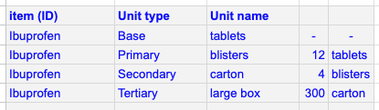
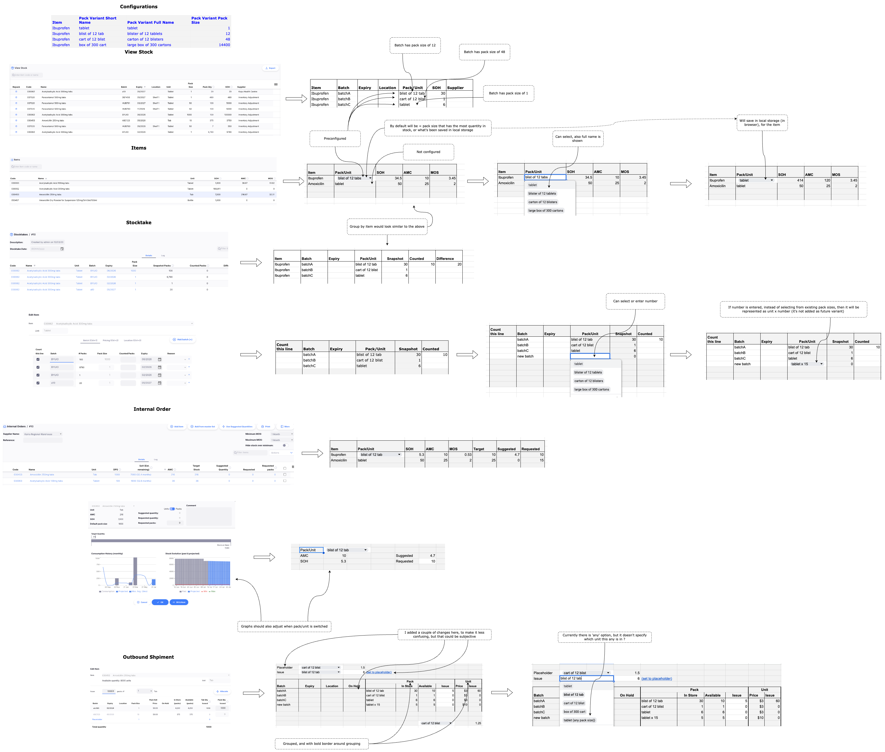

# Multi Unit Number

- *Date*: 09/08/23
- *Deciders*: Mark Glover, Gary, Adam, Richard, Craig, Andrei
- *Status*:
- *Outcome*: Option 3 (pack lens, a way to choose which of the configure unit variants to see in UI)
- *Related Material*: See original [issue](https://github.com/openmsupply/open-msupply/issues/1089)

## Background

We've noticed user's confusion in understanding pack sizes. This is especially prominent when users transition from existing systems where pack size have been concealed (i.e. multiple variants of the same item, each defining its own pack size).

It seems like the core requirements are:

**1. Ability to treat an item as having one particular pack size in a particular facility**

A couple of examples of this:
* **1.a** Lower level facility deals with millilitres (inpatient -> directly administer oral dose vai syringe to a patient) and and warehouse deals with bottles. Although it's possible to work around this by either recording consumption at lower level by bottles (not as accurate or efficient, when should they order next bottle ?) or by having base units as millilitre and large pack size at warehouse (manual conversion at the time order arrives, since we deal with base unit in order, it's much easier to comprehend 50 bottles vs 50000 mililitres)
* **1.b** Different facility levels deal with different base unit where facilities are not centrally managed (they are independent). For example warehouse deals with cartons and lower level facility deals with blisters (since requirement usually come from central level, and lower level facilities are independent, base unit in the system was configured as carton)

**2. Vaccine with varying number of doses per vial**

It sounds like we've only come accross this with covid vaccines (and in places where multiple options of covid vaccines were available), for other vaccines there seems to be a standard of doses per vial. Since we currently set doses for item only this is problematic. Could create multiple items but then, may have issues with quantification (measuring consumption across multiple items)

**3. Ability to treat an item as having varying base pack size in different UI area**

* **3.a** At a hospital, vaccines are dispensed in doses, counted and discarded (stocktake) in vials, ordered in doses and open vial wastage is recorded in doses.
* **3.b** In the warehouse, shipments are in vials but quantification and outgoing orders are in doses, incoming orders may need to be in vials (i.e. request to supply 100 vials of 10 rather then 1000 doses)

**4. Reduce confusion with units, pack size, quantity (units) and quantity (packs)**

It's been noted that even after training, we've obeserved confusion when users deal with packs, leading to incorrect data entry. 

**5. Donor reporting in a particular pack size**

Donors would like all countries to have a common pack size for item when reporting

**Extra**

For this KDD it's very important to consider implementation effort now and in the future, since it will would touch core functional area.

**Requirement Conclusion**

In general, there is agreement that some UI areas may lead to confusion, be it due to inconsistencies (in naming and how these columns/field appear in UI) but also due to confusion of the packs concept (although pharmacists and warehouse personnel are aware of this concept, there is still some congitive load which increases room for error). This is for **Requirement 4**

Although treating an item as having one particular pack size can be benificial in some cases, there is already provision for this (to some extend), we already treat batch as having one particular pack size, and with repacks we can split stock to the desired pack size and it's treated as that pack size for remaining operations (issue and stocktake), it's also very possible to have more then one pack size for the same item at a facility (so a slight contradiciton to **Requirement 1.a**). However there is a gap, when stock is ordered, it's always in base unit. This is for ordering bit of **Requirement 1.a**

It looks like for vaccines with different doses per vial, we can use different items, since this case only appiled to Covid 19 vaccines and it looks like in those cases we do want to treat them as seperate items (even for the same manufacturer, vaccines targeting different age groups for example would have different doses, as per [this site](https://www.health.gov.au/our-work/covid-19-vaccines/advice-for-providers/clinical-guidance/doses-and-administration)). We did consider adding a requirement for consolidation of these items for quantification, however it does look like a very specific use case for vaccines (and in fact for Covid 19 vaccine only). So it seems that **Requirement 2.** would need to be considered in isolation

As for **Requirement 3.**, although it could be benificial, the wider team didn't really expressed this as being important. If proposed Options deals with this use case it would be a bonus, but not essential

Note, that **Requirement 1.a** should also meet **Requirement 5.** since requisitions are oftern consider the reporting tools (RnR forms, Report and Requisition)

## Options

### Option 1 - Training + Clear and common vocabulary 

Very clear language (used uniformly across all of the UI), i.e.:

Number of units (vs quantity or total)

Number of packs (vs Pack Qty etc..)

In all UI areas where this concept appears, we should display it the same (same number of column, in the same order, maybe even with a border grouping them).

Have a very solid onboarding during training, focused on concept of packs and units (as the first training task). Showing scenarior where it's important to deal with different packs at the same facility. And explaining the glossary terms that are used in the system and how they relate to these concepts.

*Pros:*

- Most flexible (the system was originally design to be this way for a good reason, but of course original target user group maybe quite different to the user group in this KDD)

*Cons:*

- Ideally our UI/UX would not need to rely too much on training (it would be intuative for a range of users), maybe this one can be turned into a pro if we improve presentation ¯\_(ツ)_/¯
- In some places like in requisition, we deal with Number of Units (so can't really deal with Number of Packs), although there has been an option added to order in packs, but that default for the item (across all stores)
- Users would need to deal with very large numbers at some point (i.e. for order, which are alwasy in base units)
- Doesn't deal with requirement **2**, unless we switch vaccine management to be via pack size or train to use fractional pack size

### Optoin 2 - Define item variants and assign to facilities

Define item variants, similar to the [Doses Vaccine Conversion 2023-04-27](https://docs.google.com/spreadsheets/d/1mWZqmfQRfHlwF5i2OADaBaSWalK3FbIJpauM275xYuA/edit#gid=937944726) spreadsheet:

Then one unit type can be associated to a facility (through name_tag)

Now in that facility the base unit will reflect the unit type that was chosen.

If this conversion is done at graphql layer (back end), we have a smaller surface area to deal with (and can have generic translators for input/output, example to follow).

*Pros:*

- Deals with the core issue in a direct way

*Cons:*

- Some fragility is introduced due to configuration (i.e. it maybe easy to mess things up for a facility through configurations)
- Could cause issues if facility needs to deal with a different pack size, with this solution it would lead to fractional pack size (i.e. default unit for facility is of packsize 10, but we received pack size 5, this would mean there would be fractional number of packs).
- Need to make sure to always add the pack size conversion translator
- Doesn't quite deal with requirement **2** or **3**

*Extra:*

A few comment suggesting that user should also have an option to select which pack to deal with (meaning graphql would likely need to have a parameter for this ?)

### Option 3 - Use names rather then packsize (through pack 'lens')

I think this was the suggestion from the [Doses Vaccine Conversion 2023-04-27](https://docs.google.com/spreadsheets/d/1mWZqmfQRfHlwF5i2OADaBaSWalK3FbIJpauM275xYuA/edit#gid=937944726) spreadsheet:

Define unit types (pack variations) for item centrally, by number of packs and name, i.e.

Display pack size in defined variations (if variations are defined and there is a match with pack size).

Allow changing to different unit/pack with drop down in some areas (record choice in browser app data)

I think this is what @adamdewey was going for, I had to look up all UI areas and see how this would look, for reference see 'Andrei' [sheet here](https://app.diagrams.net/#G1wEOEYFte4lq9iYDzmeXHcL7ys-4fZZ1I) and [diagram here](https://app.diagrams.net/#G1wEOEYFte4lq9iYDzmeXHcL7ys-4fZZ1I)

*Pros:*

- Generic approach that deals with most use cases, can even go below pack size one (with fractional pack size, for doses and **Requirement 1.b**)

*Cons:*

- Quite a few changes
- Existing user would need some training (but that's only if configurations are introduced)
- Would need to deal with fractional number of packs more often

*Extra:*

We may want to display total in units in more places then outbound shipment, for example as a guide when doing a stock take, this can be done quite easily in drop downs (since we have more screen real estate then) or maybe on hover or info icon on the lines

## Decision

I am now recommending Option 3, I like the general idea even though it touches quite a few UI areas (there would be more UI areas affected in the future if it's not done now). I estimate 2 weeks of work for option 3 (1 week for configuration 1 week for enforcing them in UI, would suggest we do central configurations in omSupply, as per this idea 'todo add central server configuration with omSupply, parallel sync server' idea)
Option 1 would also be good if we are able to `group` packs/units columns and fields as showm in Option 3, and use existing default pack size for item for internal orders.

Option 3 was chosen, there was some concern about reports needing to implement this if it's implemented in UI, this was not deemed critical (reports can still be base unit, and if the need arrises we can do reports based on default unit variant)

## Extra

With any chosen solution, we should not change underlying storage of pack size and quantity for a batch (i.e. still the same schema and mechanims, only presentation layer is adjusted)

Requirement **2** complicates any solution that helps solve **1** and **3**, since it adds another variation to the mix. I've mentioned this a few times and would want to mention it again, I think vaccines should have a special logic and UI/UX, trying to address special cases for vaccines in a generic way would lead to complexity in implementation and complicated UX/UI. I suggest treating requirement **2** and maybe **3** as a separate design that applies to vaccines only.
