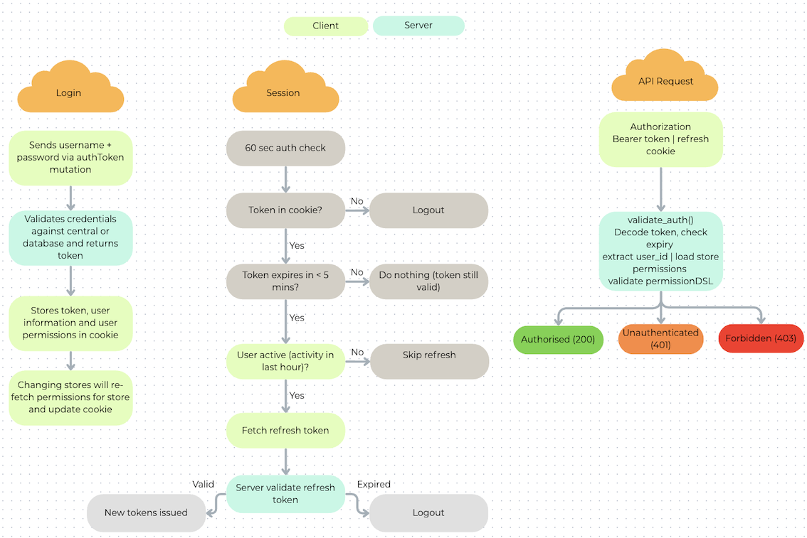

# Authentication

Open mSupply uses a JWT-based access/refresh token pair model. The Rust server issues a short-lived auth token (JWT) and a longer-lived refresh token (HttpOnly cookie) on login. The client stores the auth token in a cookie and automatically refreshes it when it's about to expire, as long as the user is active. If the refresh token expires (after 2 hours of inactivity), the session ends and the user must log in again.

## Simplified Overview



## Token lifecycles

| Token Type    | Lifetime          | Storage Location                       | Purpose                                                                                 |
| ------------- | ----------------- | -------------------------------------- | --------------------------------------------------------------------------------------- |
| Auth Token    | 1 hour            | Cookie (accessible to JS)              | Used for authenticating API requests. Contains user info and permissions.               |
| Refresh Token | 2 hours (rolling) | HttpOnly Cookie (not accessible to JS) | Used to obtain new auth tokens without re-login. Server checks its validity and expiry. |

## Timeline Example

```
T+0:00   Login
         ├─ Auth JWT created    (expires T+1:00)
         └─ Refresh token created (expires T+2:00)  ◄── SESSION ENDS HERE

T+0:55   Polling loop: JWT expires in 5 min → refresh
         ├─ Server: refresh token valid (exp T+2:00) → issues new auth JWT (exp T+1:55)
         └─ New refresh token issued (exp T+2:55)
```

**Important**: each successful refresh issues a **new refresh token** with a fresh expiry. So an active user's session keeps extending. The 2-hour timeout only kicks in when the user stops interacting (and the client stops refreshing).

```
T+0:00   Login           → refresh exp = T+2:00
T+0:55   Auto-refresh    → refresh exp = T+2:55  (extended!)
T+1:50   Auto-refresh    → refresh exp = T+3:50  (still goin'!)
...
T+4:45   Auto-refresh    → refresh exp = T+6:45  (last refresh before inactivity)
T+5:00   User walks away. No mouse/keyboard/touch/scroll events.
T+6:00   60 min inactivity → isActive() returns false → polling skips refresh
T+6:00   Last refresh token expires at ~T+6:45
T+6:45   User returns → polling loop fires → refresh FAILS → LOGOUT
```
