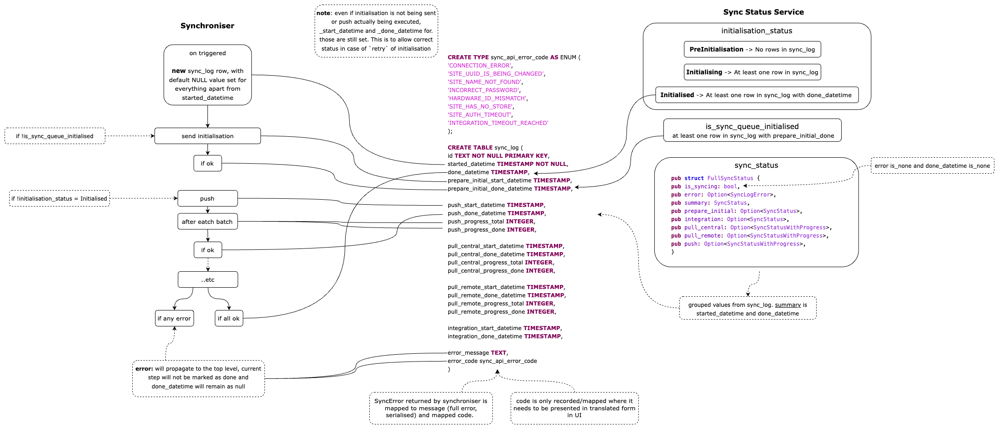

+++
title = "Sync Logger and Sync Status"
weight = 10
sort_by = "weight"
template = "docs/section.html"
source = "code"
+++

# Sync Logger and Sync Status

Sync logger is used to record sync progress in [sync_log] and sync status is derived from records in [sync_log], as per diagram:

From [TMF internal google doc](https://app.diagrams.net/#G1HAj2K_29KUNKGrgA9v8k1cIgF4455C2D):

