# Daily Tally Sheet - User Guide

The Daily Tally Sheet is a dispensary feature in Open mSupply that allows health facility staff to record the daily use and wastage of vaccines and other medical items. It supports demographic coverage tracking for vaccination programs and generates aggregated coverage reports.

## Key Features

- Record daily item usage (issued quantities) for vaccines and non-vaccine items
- Track open vial wastage for multi-dose vaccine vials
- Enter vaccination coverage data broken down by demographic groups (age, gender, pregnancy status)
- Manage batch-level allocation for items with multiple stock batches
- Generate aggregated vaccination coverage reports over any date range

---

## Table of Contents

1. [Prerequisites](#1-prerequisites)
2. [Navigating to Daily Tally](#2-navigating-to-daily-tally)
3. [Daily Tally List View](#3-daily-tally-list-view)
4. [Creating a New Daily Tally Entry](#4-creating-a-new-daily-tally-entry)
   - [Entering Vaccine Item Data](#41-entering-vaccine-item-data)
   - [Entering Vaccine Coverage Data](#42-entering-vaccine-coverage-data)
   - [Entering Non-Vaccine Item Data](#43-entering-non-vaccine-item-data)
   - [Multi-Batch Allocation](#44-multi-batch-allocation)
5. [Confirming a Daily Tally Entry](#5-confirming-a-daily-tally-entry)
6. [Viewing Coverage Reports](#6-viewing-coverage-reports)
7. [Simplified / Mobile Mode](#7-simplified--mobile-mode)
8. [Tips and Troubleshooting](#8-tips-and-troubleshooting)

---

## 1. Prerequisites

Before using the Daily Tally Sheet, ensure the following:

| Requirement | Details |
|---|---|
| **Store mode** | Your store must be set to **Dispensary** mode. The Daily Tally menu item only appears in Dispensary stores. |
| **Plugin installed** | The Afghanistan Daily Tally plugin must be installed on your server. Contact your system administrator if the Daily Tally option does not appear. |
| **Stock on hand** | Items must have available stock (SOH > 0) to appear in the daily tally form. |
| **Vaccine configuration** | Vaccine items should have the **doses per vial** value configured so that stock is correctly displayed in doses. |
| **Patient records** | At least one patient record must exist in the system. A patient must be selected when recording used quantities. |

---

## 2. Navigating to Daily Tally

The Daily Tally feature is accessed from the **Dispensary** module in the left sidebar navigation.

1. Log in to Open mSupply and ensure you are in a **Dispensary** store.
2. In the left sidebar, click **Daily Tally**.

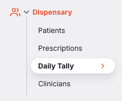

This takes you to the **Daily Tally List View**, where you can browse existing tally sheets or create a new one.

The Daily Tally feature has three main views:

| View | Purpose | How to Access |
|---|---|---|
| **List View** | Browse and open existing daily tally sheets | Dispensary > Daily Tally |
| **Create View** | Create a new daily tally entry | Click "Add new tally sheet" from the list view |
| **Report View** | View aggregated vaccination coverage reports | Reports > Daily Tally |

---

## 3. Daily Tally List View

The list view displays all previously created daily tally sheets in a table.


### Table Columns

| Column | Description |
|---|---|
| **Reference** | The tally sheet reference (e.g., `daily tally-08/04/2026`) |
| **Name** | The patient name associated with the tally |
| **Invoice Number** | The system-generated invoice number |
| **Prescription Date** | The date the tally was created |

### Actions

- **Filter**: Use the filter bar at the top to search by reference or filter by date range (from/to date).
- **Sort**: Click any column header to sort the table.
- **Open**: Click any row to open the associated prescription record.
- **Add new tally sheet**: Click the button in the top-right corner to create a new daily tally entry.

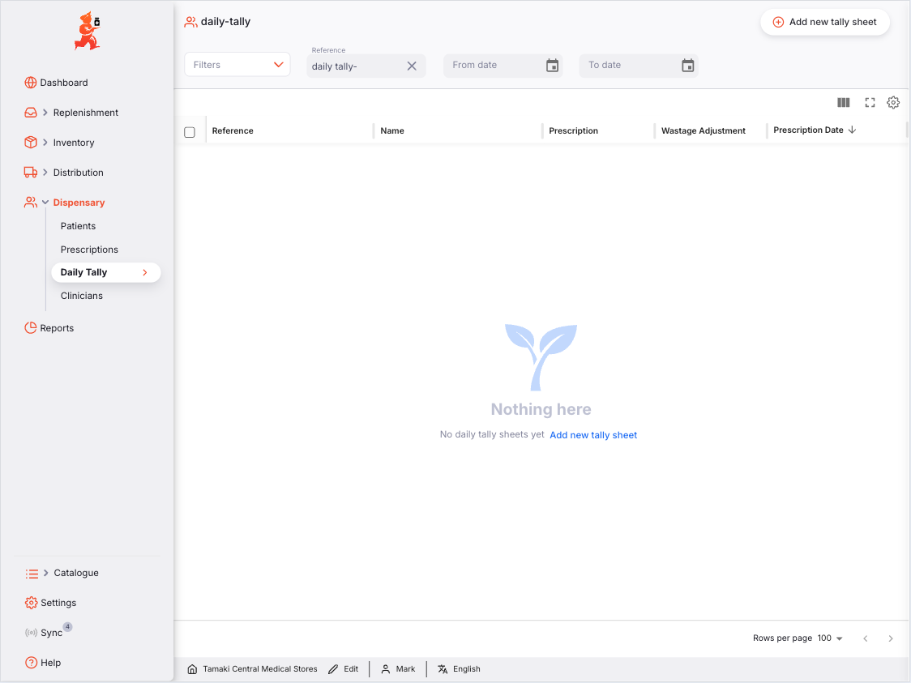

> **Note:** If no tally sheets have been created yet, you will see a message: "No daily tally sheets yet" with a button to add a new one.

---

## 4. Creating a New Daily Tally Entry

Click **Add new tally sheet** from the list view to open the create form.

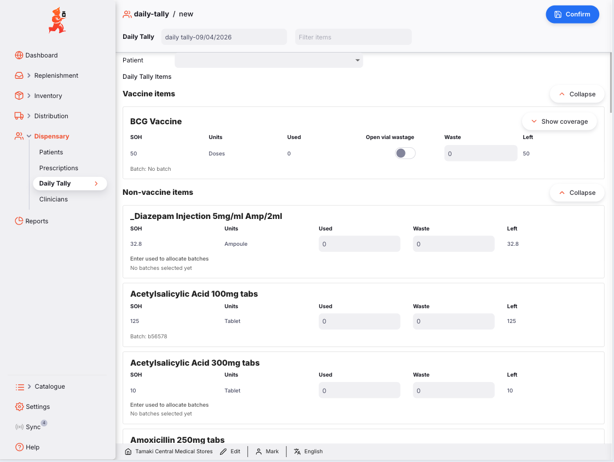

### Top Bar Fields

| Field | Description |
|---|---|
| **Reference** | Auto-populated with `daily tally-DD/MM/YYYY` (today's date). You can edit this if needed. |
| **Filter Items** | Type to search and filter the list of stock items by name. |
| **Confirm** (save icon) | Located in the top-right corner. Click to validate and save the tally entry. |

### Patient Selection

Below the top bar, you will see a **Patient** dropdown.

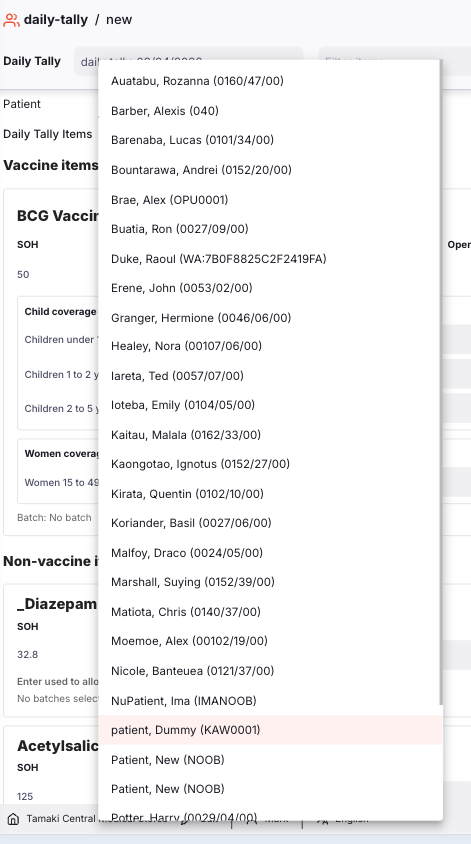

- Select the patient associated with this daily tally.
- **This field is required** if you enter any "Used" quantities for items.
- The dropdown lists up to 2,000 patients sorted alphabetically.

### Item Sections

Items are organized into two collapsible sections:

1. **Vaccine items** - Items marked as vaccines in the system
2. **Non-vaccine items** - All other stock items

Click the expand/collapse arrow on each section header to show or hide items.

---

### 4.1 Entering Vaccine Item Data

Each vaccine item is displayed as a row with the following columns:

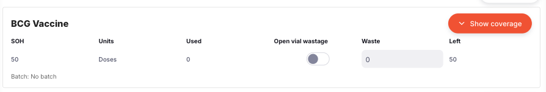

| Column | Description | Editable? |
|---|---|---|
| **SOH** | Stock on hand, displayed in **doses** (packs x doses per vial) | No |
| **Units** | Always shows "Doses" for vaccine items | No |
| **Used** | Number of doses used. In standard mode, this auto-calculates from coverage data (see below). | Auto-calculated |
| **Open vial** | Toggle switch to indicate open vial wastage. When enabled, the system auto-suggests a wastage value. | Yes |
| **Waste** | Number of doses wasted. Auto-suggested when "Open vial" is toggled on, but can be manually overridden. | Yes |
| **Left** | Remaining stock, calculated as: SOH - Used - Waste | No |

#### Open Vial Wastage

When you toggle the **Open vial** switch on for a vaccine:

- The system automatically calculates the expected wastage based on the vial size. For example, if a vial contains 10 doses and 7 doses were used, the open vial wastage suggestion would be 3 doses.
- You can manually adjust the wastage value if needed.
- The toggle is only available when the item has a single stock batch. For multi-batch items, open vial wastage is set per batch (see [Multi-Batch Allocation](#44-multi-batch-allocation)).

---

### 4.2 Entering Vaccine Coverage Data

For each vaccine item, click the **Show coverage** button to expand the demographic coverage section.

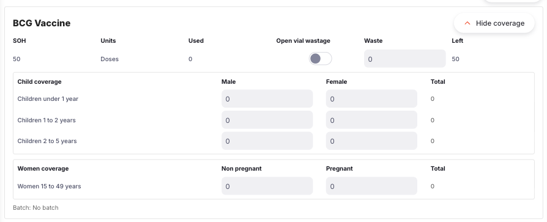

Coverage is divided into two tables:

#### Child Coverage

| Column | Description |
|---|---|
| **Age Group** | The child age group label |
| **Male** | Number of male children vaccinated |
| **Female** | Number of female children vaccinated |
| **Total** | Auto-calculated sum of Male + Female |

The default child age groups are:

| Age Group | Description |
|---|---|
| Children under 1 year | Infants aged 0-11 months |
| Children 1 to 2 years | Children aged 12-23 months |
| Children 2 to 5 years | Children aged 24-59 months |

#### Women Coverage

| Column | Description |
|---|---|
| **Age Group** | The women age group label |
| **Non-pregnant** | Number of non-pregnant women vaccinated |
| **Pregnant** | Number of pregnant women vaccinated |
| **Total** | Auto-calculated sum |

The default women age group is:

| Age Group | Description |
|---|---|
| Women 15 to 49 years | Women of childbearing age |

#### How Coverage Affects the "Used" Column

In standard mode, the **Used** value for a vaccine item is **automatically calculated** as the sum of all coverage entries:

```
Used = (all child Male + Female totals) + (all women counts)
```

You do not enter the "Used" value directly for vaccines. Instead, enter the coverage breakdown and the used quantity will update automatically.

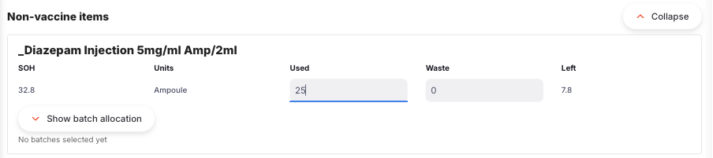

> **Note:** If your system has custom demographic groups configured, they will appear instead of the defaults. The system automatically maps demographic data to the appropriate age groups.

---

### 4.3 Entering Non-Vaccine Item Data

Non-vaccine items have a simpler layout without coverage tracking.

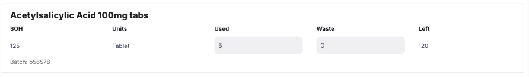

| Column | Description | Editable? |
|---|---|---|
| **SOH** | Stock on hand in the item's native unit | No |
| **Units** | The item's unit of measure (e.g., Tablets, Bottles) | No |
| **Used** | Number of units used. Enter directly. | Yes |
| **Waste** | Number of units wasted. Enter directly. | Yes |
| **Left** | Remaining stock: SOH - Used - Waste | No |

> **Note:** Non-vaccine items do not have the "Open vial" toggle since open vial wastage only applies to multi-dose vaccine vials.

---

### 4.4 Multi-Batch Allocation

When an item has **multiple stock batches**, you need to specify how the used and wasted quantities are distributed across batches.

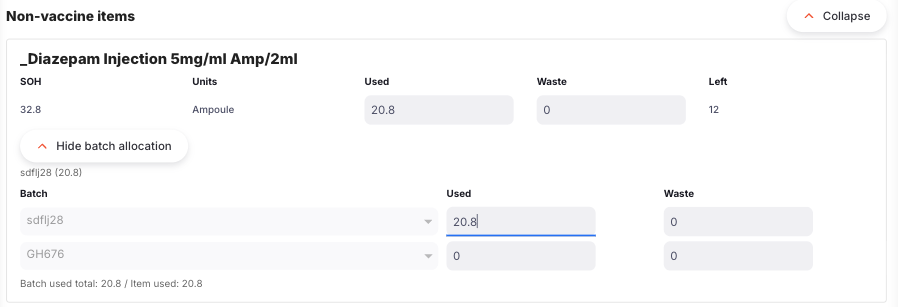

#### When Does Batch Allocation Appear?

Batch allocation is available when:
- The item has more than one stock batch
- You have entered a used quantity greater than zero

A **Show batch allocation** button appears below the item row. Click it to expand the batch allocation table.

#### Batch Allocation Table

| Column | Description |
|---|---|
| **Batch** | The batch identifier (batch number, expiry date, or stock line ID) |
| **Used** | Number of units/doses used from this batch |
| **Open vial** | Toggle for open vial wastage (vaccines only; enabled when used > 0) |
| **Waste** | Number of units/doses wasted from this batch |

#### Important Rules

- The **sum of all batch "Used" values must exactly match** the item's total "Used" value.
- Each batch's used value **cannot exceed** that batch's available stock.
- The system uses **FIFO (First Expiry, First Out)** allocation by default, allocating from the earliest-expiring batches first.

If the batch totals do not match, you will see an error message:

> "Batch used total must exactly match item used."

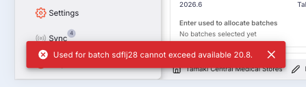

---

## 5. Confirming a Daily Tally Entry

Once you have entered all data, click the **Confirm** button (save icon) in the top-right corner.

### Step 1: Validation

The system runs several validation checks before proceeding:

| Validation | Error Message |
|---|---|
| At least one item must have a used or wastage value | "Enter used or wastage values before confirming" |
| Used + Waste must not exceed SOH | "Invalid input for [item]: Used + Wastage must be <= SOH" |
| Patient must be selected if any items have used > 0 | "Select a patient before confirming used quantities" |
| Vaccine coverage must be entered (standard mode) | "Enter coverage for [item]." |
| Multi-batch used totals must match item used | "For [item], batch Used is mandatory and must equal row Used." |
| Batch used cannot exceed batch stock | "For [item], one or more batch Used values exceed that batch stock." |

If any validation fails, a notification will appear and the confirmation is cancelled. Fix the issue and try again.

### Step 2: Confirmation Summary

If validation passes, a **Confirmation Summary** dialog appears showing all items that will be recorded.

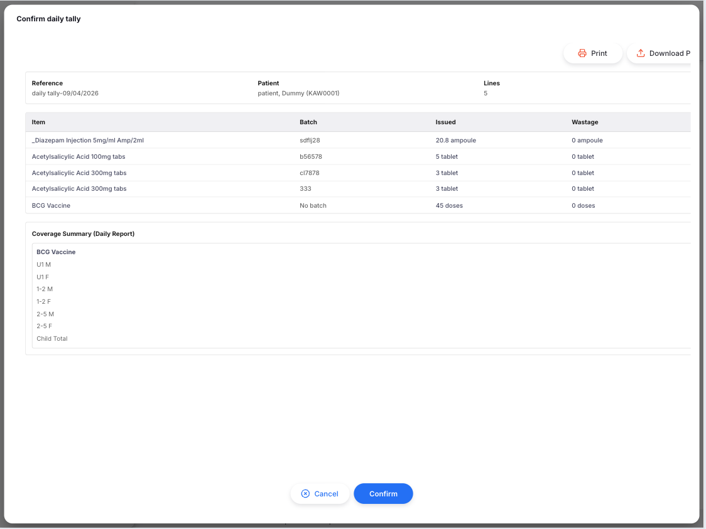

The summary table shows:

| Column | Description |
|---|---|
| **Item** | The item name |
| **Batch** | The batch identifier |
| **Issued** | The quantity and unit being issued (e.g., "10 Doses") |
| **Wastage** | The quantity and unit being recorded as waste |

For vaccine items, a coverage summary is also displayed showing the demographic breakdown (e.g., "Child: Children under 1 year M:3 F:2; Women: Women 15 to 49 years 5").

Review the summary carefully and click **OK** to proceed.

### Step 3: Duplicate Day Warning

If a daily tally sheet already exists for the same day, the system will show a warning:

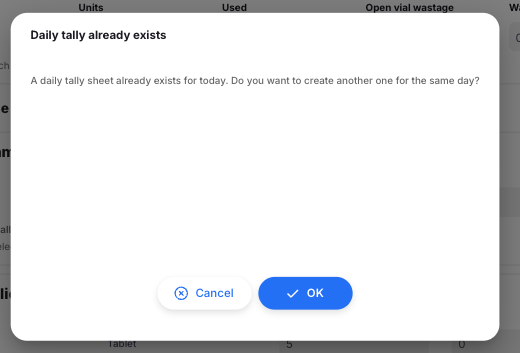

> "A daily tally sheet already exists for today. Do you want to create another one for the same day?"

You can choose to proceed or cancel.

### Step 4: Data Created

When confirmed, the system creates:

1. **A Prescription record** for all issued items (used > 0), linked to the selected patient.
2. **A Stocktake record** for all wastage items (waste > 0), which finalises immediately to adjust stock levels.

You will see a success notification: **"Daily tally confirmed"** and be redirected to the Daily Tally list view.

---

## 6. Viewing Coverage Reports

The Daily Tally Coverage Report aggregates vaccination data across all daily tally entries for a given date range.

### Accessing the Report

1. Navigate to the **Reports** section in the sidebar.
2. Find the **Daily Tally** card and click it.


### Report Filters

At the top of the report view, you can filter by:

- **Reference**: Search for specific tally references
- **Date range**: Set a "from" and "to" date to narrow the report period

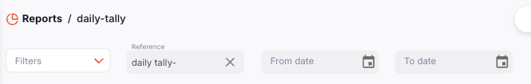

### Child Vaccination Table

The first table shows vaccination counts for children, broken down by age group and gender.

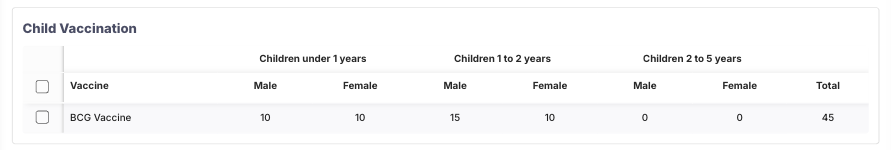

| Column | Description |
|---|---|
| **Vaccine** | The vaccine item name |
| **Children under 1 year - Male** | Male children aged 0-11 months |
| **Children under 1 year - Female** | Female children aged 0-11 months |
| **Children 1 to 2 years - Male** | Male children aged 12-23 months |
| **Children 1 to 2 years - Female** | Female children aged 12-23 months |
| **Children 2 to 5 years - Male** | Male children aged 24-59 months |
| **Children 2 to 5 years - Female** | Female children aged 24-59 months |
| **Total** | Sum of all columns for that vaccine |

Only vaccines with at least one vaccination entry are shown.

### Women Vaccination Table

The second table shows vaccination counts for women, broken down by pregnancy status.


| Column | Description |
|---|---|
| **Vaccine** | The vaccine item name |
| **Women 15 to 49 years - Pregnant** | Pregnant women aged 15-49 |
| **Women 15 to 49 years - Non pregnant** | Non-pregnant women aged 15-49 |
| **Total** | Sum of both columns for that vaccine |

Only vaccines with at least one entry are shown.

> **Note:** If no data exists for the selected date range, the report displays: "No Daily Tally coverage data found for this date range."

---

## 7. Simplified / Mobile Mode

When using Open mSupply on a **tablet** or when the **simplified mobile UI** preference is enabled, the Daily Tally form operates in a streamlined mode.


### Differences in Simplified Mode

| Feature | Standard Mode | Simplified Mode |
|---|---|---|
| **Vaccine coverage entry** | Required; Used auto-calculates from coverage | Hidden; not required |
| **Used field (vaccines)** | Read-only (auto-calculated) | Directly editable |
| **Show/Hide coverage button** | Visible | Hidden |
| **Coverage validation** | Required before confirm | Skipped |
| **Layout** | Full desktop layout | Compact, touch-friendly |

In simplified mode, you enter the **Used** quantity directly for all items (including vaccines), just as you would for non-vaccine items.

---

## 8. Tips and Troubleshooting

### Best Practices

- **One tally per day**: While the system allows multiple tally sheets per day, it is best practice to create one per day to avoid duplication in reports.
- **Verify batch allocation**: For multi-batch items, always check that the batch used totals match the item used before confirming.
- **Check remaining stock**: The "Left" column helps you quickly verify that stock levels make sense after your entries.
- **Use filters**: When you have many items in stock, use the "Filter Items" field to quickly find the item you need.

### Common Issues

| Issue | Cause | Solution |
|---|---|---|
| "Enter used or wastage values before confirming" | No items have any used or waste values entered | Enter at least one used or wastage value for any item |
| "Select a patient before confirming used quantities" | Used quantities entered but no patient selected | Select a patient from the dropdown at the top of the form |
| "Invalid input for [item]: Used + Wastage must be <= SOH" | The total of used + waste exceeds available stock | Reduce the used or waste values so they do not exceed SOH |
| "Enter coverage for [item]" | Vaccine coverage data not entered (standard mode) | Click "Show coverage" and enter demographic data for the vaccine |
| "Batch Used is mandatory and must equal row Used" | Multi-batch item totals do not match | Adjust batch-level used values so they sum to the item total |
| "One or more batch Used values exceed that batch stock" | A batch has more usage than available | Reduce the batch used value to within its available stock |
| Daily Tally not visible in sidebar | Store is not in Dispensary mode, or plugin not installed | Check your store mode setting; contact your administrator |
| No items appear in the form | No items have stock on hand | Verify stock has been received for the items you expect to see |

### Understanding the Data Created

Each confirmed daily tally creates two records in the system:

```
Daily Tally Confirmation
        |
        +---> Prescription (for items with Used > 0)
        |     - Linked to selected patient
        |     - Contains one line per item/batch
        |     - Stores coverage data in line notes
        |     - Status: Verified
        |
        +---> Stocktake (for items with Waste > 0)
              - Description: "Daily tally wastage"
              - Contains one line per item/batch
              - Adjusts stock levels immediately
              - Status: Finalised
```

This means:
- **Used quantities** appear as prescription records and reduce stock through the prescription workflow.
- **Wastage quantities** appear as stocktake adjustments and reduce stock immediately.
- **Coverage data** is stored within prescription line notes and is read by the coverage report.

---

*This guide covers Open mSupply v2.17.0 and later with the Afghanistan Daily Tally plugin installed.*
