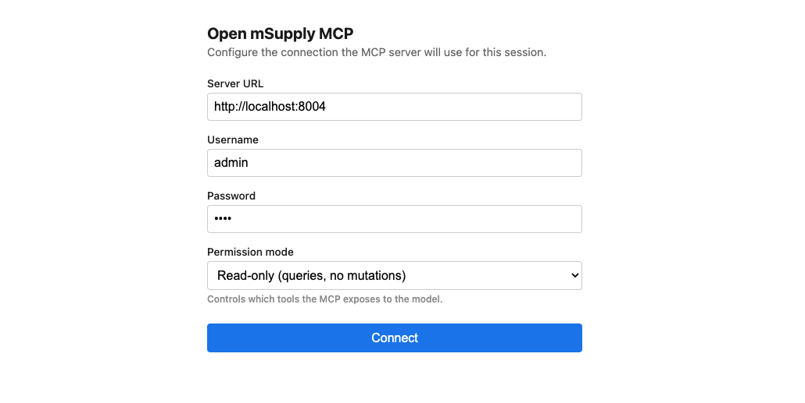

# Open mSupply MCP Server

A [Model Context Protocol](https://modelcontextprotocol.io) server that exposes the Open mSupply GraphQL API as tools for LLM clients (Claude Desktop, Claude Code, VS Code, Cursor, etc.).

## Highlights

- **56 tools** — queries and mutations across stores, stock, invoices, requisitions, stocktakes, locations, purchase orders, names/patients, master lists, dashboards, reports, file download, and record documents.
- **Browser-based first-run auth** — if credentials aren't set via env vars, the server opens a configuration page on `http://localhost:39101` on the first tool call. Values persist in browser `localStorage` across restarts; nothing is written to disk.
- **Connection test built in** — the browser page calls the mSupply `authToken` mutation before handing credentials to the MCP, so you can't submit invalid creds.
- **Preset permission modes** — pick `read-only`, `read-write`, or `safe-mutations` (everything except deletes) from the browser form or via `OMSUPPLY_MODE`.
- **Multiple layers of permission control** — preset modes → env overrides → LLM-client-side toggles.
- **Safe by default** — queries are on, mutations are off, deletes require the explicit `read-write` mode.
- **`list_my_stores`** — first-class tool to find the stores the authenticated user can actually use (avoids the usual `Forbidden` dance).

## Install & Build

```bash
cd mcp
yarn install
yarn build
```

Outputs to `dist/index.js`, which is the binary the MCP client runs.

## Configuration

The server loads config from env vars passed via the MCP client's config file. Any field you don't provide via env will be requested through the browser flow on first use.

### Minimal (browser-driven)

Commit this as `.mcp.json` at the repo root — no secrets, no per-machine tweaks needed:

```json
{
  "mcpServers": {
    "open-msupply": {
      "command": "node",
      "args": ["mcp/dist/index.js"]
    }
  }
}
```

The path is relative to the repo root — MCP clients launch the server with the repo as CWD. Use an absolute path only if the config lives outside the repo (e.g. a per-user `~/.claude/settings.json`).

On first tool call, the browser opens `http://localhost:39101` with a form asking for server URL, username, password, and a permission mode. Credentials are tested against `/graphql` before the MCP accepts them.



### Headless / CI — env vars

Set any subset of env vars. Anything set via env takes precedence over the browser and locks that field in the form:

```json
{
  "mcpServers": {
    "open-msupply": {
      "command": "node",
      "args": ["mcp/dist/index.js"],
      "env": {
        "OMSUPPLY_URL": "http://localhost:8000",
        "OMSUPPLY_USERNAME": "admin",
        "OMSUPPLY_PASSWORD": "pass",
        "OMSUPPLY_MODE": "read-only"
      }
    }
  }
}
```

If **all** of `OMSUPPLY_URL`, `OMSUPPLY_USERNAME`, and `OMSUPPLY_PASSWORD` are set, the browser never opens.

### Environment variables

| Variable | Required | Description |
|---|---|---|
| `OMSUPPLY_URL` | No (browser fallback) | Server URL (e.g. `http://localhost:8000`). |
| `OMSUPPLY_USERNAME` | No (browser fallback) | Login username. |
| `OMSUPPLY_PASSWORD` | No (browser fallback) | Login password. |
| `OMSUPPLY_STORE_ID` | No | Default active store — equivalent to calling `set_active_store`. |
| `OMSUPPLY_MODE` | No | Preset permission mode: `read-only`, `read-write`, `safe-mutations`. |
| `OMSUPPLY_ALLOW_SELF_SIGNED` | No | `true` to trust self-signed TLS certs. |
| `OMSUPPLY_ALLOW_MUTATIONS` | No | `true` to enable mutation tools (equivalent to `OMSUPPLY_MODE=read-write`). |
| `OMSUPPLY_ALLOWED_CATEGORIES` | No | Comma-separated category allowlist. |
| `OMSUPPLY_DISABLED_TOOLS` | No | Comma-separated per-tool blocklist (e.g. `delete_outbound_shipment,update_stock_line`). |
| `OMSUPPLY_ENABLED_TOOLS` | No | Comma-separated per-tool allowlist — if set, **only** these tools are enabled. |
| `OMSUPPLY_DOWNLOAD_DIR` | No | Where `download_file` writes fetched files. Defaults to `<os tmpdir>/open-msupply-mcp`. |

## Authentication & Session Flow

1. The MCP client launches this process via stdio.
2. On the **first tool call**, the client runs `authenticate()`:
   - If env creds are present, it POSTs to `${OMSUPPLY_URL}/graphql` with the `authToken(username, password)` mutation and caches the bearer token.
   - If creds are missing, it launches the browser flow. The localhost page tests the submitted credentials against the target server before the MCP accepts them. On success the MCP caches creds + token in memory for the process's lifetime.
3. If any subsequent query returns `401` / `Unauthenticated`, the token is cleared and the authenticate step runs again once (for token expiry), then the query is retried.
4. If the server returns `Forbidden` on a store-scoped query, the error message hints at calling `list_my_stores`.

All state (token, active store) is in memory. Nothing is written to the filesystem. Browser `localStorage` (scoped to `http://localhost:39101`) retains the last-used URL/username/password/mode so the form pre-fills on next restart.

## Permissions

Layered from most-specific to least:

1. `enabledTools` — if non-empty, **only** these tools are allowed.
2. `disabledTools` — explicit blocklist.
3. Per-category overrides — `categories: { invoices: { mutations: true } }`.
4. Master switches — `queries` / `mutations`.

### Preset modes

Preset modes are shortcut configurations applied via `OMSUPPLY_MODE` or the browser form:

| Mode | What's available |
|---|---|
| `read-only` | Only read/query tools — nothing that changes server state. |
| `read-write` | Everything — queries, inserts, updates, deletes. |
| `safe-mutations` | Queries, inserts, updates — **no deletes**. |

A mode picked from the browser form applies to the current session only. Set `OMSUPPLY_MODE` (or equivalent env vars) for a durable default that survives restarts without re-picking.

### Runtime enforcement

Permissions are checked **at call time**, not at tool registration. If you change the mode via the browser form after a tool is registered, the new mode takes effect for the next call.

## Tool Catalog

### System (5)
- `list_stores` — every store on the server (including ones the user can't access).
- `list_my_stores` — stores the authenticated user can actually query.
- `get_store` — store details by ID.
- `get_server_info` — API version.
- `set_active_store` — pick a store for subsequent calls (equivalent to passing `storeId` to each tool).

### Items (3)
- `search_items` — search by code or name.
- `get_item` — full details including available batches.
- `get_item_ledger` — stock-movement history with running balance.

### Stock (3)
- `get_stock_lines` — per-batch stock view with pagination, filter, and sort.
- `get_stock_counts` — summary stock health (expired, expiring soon, item-count breakdown).
- `update_stock_line` *(mutation)* — change batch, expiry, location, price, hold.

### Invoices (12)
- `list_invoices` — filter by type, status, counter-party.
- `get_invoice` — full invoice with lines.
- `get_invoice_by_number` — lookup by `invoiceNumber` + type.
- `get_outbound_shipment_counts`, `get_inbound_shipment_counts`.
- `insert_outbound_shipment`, `update_outbound_shipment`, `delete_outbound_shipment` *(mutations)*.
- `insert_inbound_shipment`, `update_inbound_shipment`, `delete_inbound_shipment` *(mutations)*.
- `insert_inbound_shipment_line` *(mutation)* — add stock lines to an inbound shipment. Once the parent shipment moves to `DELIVERED`/`VERIFIED`, these lines become real stock.
- `insert_prescription` *(mutation)* — requires a patient ID from `search_patients`.

### Requisitions (7)
- `list_requisitions` — filter by type, status, counter-party.
- `get_requisition`, `get_requisition_by_number`.
- `get_requisition_counts`.
- `insert_request_requisition` *(mutation)* — counter-party **must be another mSupply store**; use `search_names` with `isStore: true`.
- `update_request_requisition`, `delete_request_requisition` *(mutations)*.

### Stocktakes (5)
- `list_stocktakes` — filter by status/description.
- `get_stocktake` — full stocktake with line counts/snapshots.
- `insert_stocktake`, `update_stocktake`, `delete_stocktake` *(mutations)*.

### Locations (4)
- `list_locations` — search by name or code.
- `insert_location`, `update_location`, `delete_location` *(mutations)*.

### Purchase orders (5)
- `list_purchase_orders` — filter by status or supplier.
- `get_purchase_order` — full PO with lines.
- `insert_purchase_order`, `update_purchase_order`, `delete_purchase_order` *(mutations)*.

### Names (2)
- `search_names` — customers/suppliers; filter by `isCustomer`/`isSupplier`/`isStore`.
- `search_patients` — patient directory; required for `insert_prescription`.

### Master lists (2)
- `get_master_lists` — list item catalogs.
- `get_master_list_lines` — items in a catalog.

### Dashboard (1)
- `get_dashboard_summary` — combined stock + invoice + requisition overview.

### Reports (3)
- `list_reports` — list available reports for the store; filter by context (e.g. `OUTBOUND_SHIPMENT`, `STOCKTAKE`) or name.
- `get_report` — fetch a single report's metadata + `argumentSchema` (JSON Schema describing the arguments the report accepts).
- `generate_report` — run a report; returns a `fileId` to feed into `download_file`. Accepts `dataId` (record id for record-specific reports like an invoice), `format` (`PDF`/`HTML`/`EXCEL`), and report-specific `arguments`.

### Files (1)
- `download_file` — fetches `GET /files?id=<id>` over HTTP with the auth token and saves the response to disk. Returns the local path. Defaults to `<os tmpdir>/open-msupply-mcp`; override with `OMSUPPLY_DOWNLOAD_DIR`. Uses the server-provided filename (Content-Disposition) when available.

### Documents (3)
- `list_invoice_documents` — list attachments on an invoice.
- `list_requisition_documents` — list attachments on a requisition (includes the linked requisition on the other side of a transfer).
- `list_purchase_order_documents` — list attachments on a purchase order.

## Common Workflows

### First-time connect

1. Add the MCP entry to your client's config (see [Minimal](#minimal-browser-driven)).
2. Reload your MCP client. Call any tool (e.g. `list_my_stores`).
3. The browser opens; fill in URL / username / password / mode and click **Connect**.
4. The tab shows "Connected — you can close this tab."

### Seed a store with stock

```
1. list_my_stores                    → pick a store ID
2. set_active_store                  → makes subsequent calls default to that store
3. search_names (isSupplier: true)   → pick a supplier ID
4. insert_inbound_shipment           → new shipment (status=NEW)
5. search_items                      → find items to receive
6. insert_inbound_shipment_line      → add a line for each item
7. update_inbound_shipment VERIFIED  → lines become stock
8. get_stock_lines                   → confirm
```

### Create a request requisition

```
1. search_names (isStore: true)      → pick a counter-party store
2. insert_request_requisition        → store-to-store request
3. update_request_requisition        → set status to SENT
```

### Write a prescription

```
1. search_patients                   → pick a patient ID
2. insert_prescription               → create
```

### Generate and download a report

```
1. list_reports (context: STOCKTAKE) → pick a report ID
2. get_report                        → inspect argumentSchema (optional)
3. generate_report                   → returns a fileId
   - reportId: <from step 1>
   - dataId: <record id, e.g. stocktake id> (omit for non-record reports)
   - format: PDF | HTML | EXCEL (optional)
   - arguments: { ... } (matches argumentSchema)
4. download_file                     → saves to OMSUPPLY_DOWNLOAD_DIR and returns the path
```

## Troubleshooting

| Symptom | Likely cause |
|---|---|
| `Cannot connect to Open mSupply server at … Is the server running?` | Network error — server is down or the URL is wrong. If it looks like an IPv6 issue, try `127.0.0.1` instead of `localhost`. |
| `is still initialising` | The server is up but still booting / syncing. Wait and retry. |
| `returned an internal error while authenticating` | Server reached, but its auth layer errored (often a DB/sync problem). Check the server logs. |
| `Forbidden (at X)` | The authenticated user isn't mapped to the active store. Use `list_my_stores` and `set_active_store` with one of the returned IDs. |
| `Bad user input (at insertRequestRequisition)` | Counter-party is not another mSupply store. Search with `isStore: true`. |
| Port 39101 in use | The server falls back to 39102, 39103, ... up to 5 retries. Check the stderr log line for the chosen port. |

## Writing new tools

Tools live in `src/tools/<category>/{queries,mutations}.ts`. Each exports a function that returns `ToolDefinition[]`. Register them in `src/tools/index.ts`. Filter / schema / handler are the three required fields per tool.

For GraphQL queries that return a union `*Response` wrapping a connector, remember to use `... on XConnector { … }` in the query selection set — the TypeScript codegen's `type XResponse = XConnector` alias is misleading.

## Development

```bash
yarn dev         # tsc --watch
yarn check       # tsc --noEmit
yarn start       # run the built server directly
```
