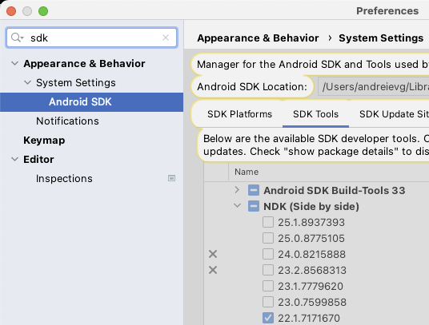

 # Android build

* Install Android Studio
* Install NDK (as per screenshot below)  **important to use version 22**

Next we need to tell rust compiler to use pre built linked for target Android ABI.
The two main (supported by devices) ABI architectures are: 

| rust target             | android ABI |
|-------------------------|-------------|
| aarch64-linux-android   | arm64-v8a   |
| armv7-linux-androideabi | armeabi-v7a |

* Add targets to to rust `rustup target add aarch64-linux-android && rustup target add armv7-linux-androideabi`
* Tell rust to use pre built linker from NDK. This is defined in .cargo/config.toml, underd [target.*]. We need to add prebuild Android ABI from NDK to PATH so that linkers/ar files can be found. 
   * Find your NDK location, my one is `~/Library/Android/sdk/ndk/22.1.7171670/toolchains/llvm/prebuilt/darwin-x86_64/bin/`
   * Permenantly add NDK_BIN env variable `echo "export NDK_BIN=~/Library/Android/sdk/ndk/22.1.7171670/toolchains/llvm/prebuilt/darwin-x86_64/bin/" >> ~/.zshrc`
   * Open new terminal and validate $NDK_BIN is set correctly: `ls $NDK_BIN` (should give a list of files starting with aarch64 and armv7a)
   * Now we can add `$NDK_BIN` to path when buiding: `PATH=$PATH:$NDK_BIN cargo build --release`

`PATH=$PATH:$NDK_BIN cargo build --release` from this directory will build for both ABI mentioned above, it's quicker to build one when doing a debug build `PATH=$PATH:$NDK_BIN cargo build --target aarch64-linux-android --release`

## How it connects to Mobile ?

See [mobile app readme](../../client/packages/mobile/README.md) for further description of how libs are connected to native java. Specifically `RemoteServer.java`, and referenced yarn scripts