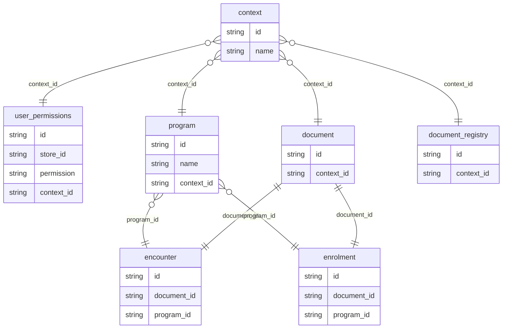

# Context Table

The motivation of the `context` table is linking independent tables together.
For example, the `user_permissions`, the `program` and the`document` table are independent concepts.
The context table makes it possible to put these tables into relations, e.g. a program has a user_permission and is related to a set of document types.

## Patient context

There is an default context entry for Patient document which created in the migration that creates the `context` table.

## Program context

Currently, the `context` table is automatically populated when syncing a master_list program, i.e. a program row is created together with the context row.
This means there is no extra user configuration of the context table needed.
The context rows have the same ID as the program and master_list entries.

## Program enrolment and Encounter tables

`programe_enrolment` and `encounter` tables don't refer directly to the `context` table but are linked through the `program` table.

# Future Work:

- Manage the context table on central, e.g. when creating a new program create the context entry on the central server.

- Currently, the permission for this Patient context is automatically added (in memory) when the user has the correct mSupply patient editing permission.
  In the future the patient permission context could automatically be added/removed on the central server when editing user permissions.
