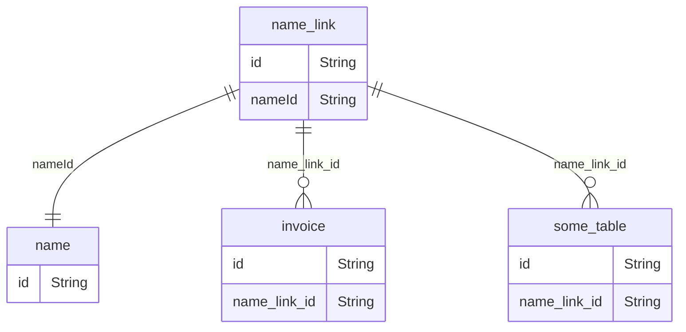

# Merging of Entities (e.g. Names or Items)

Two or more entities such as items or names may be merged after they have been created, e.g. because there are duplicates.
When merging two entities one entity is soft deleted while the second entity stays in the system and is not considered the "merged" entity.
Merging multiple entities can be achieved by recursively merging two entities till all entities are merged.

<!-- Links -->

One problem that occurs after a merge is that other table rows may still point to the soft deleted entity.
To solve this problem link tables are introduced and tables refer to these link tables instead of real entities.
For example,



<!-- Link creation -->

Links are created along with the entities they point to.
The initial id of a link is always the same as the entity id it points to, e.g.:

```rust
NameLink: {id: "new_name_id", name_id: "new_name_id"}
```

<!-- Merging links -->

When two entities are merged all link rows which point to the soft deleted entity needs to be updated to point to the new entity.
For example, when merging `"old_id"` into `"kept_name_id"`:

```rust
NameLink {id: "old_id", name_id: "old_id"}
NameLink {id: "previously_merged", name_id: "old_id"}
NameLink {id: "kept_name_id", name_id: "kept_name_id"}
```

becomes

```rust
NameLink {id: "old_id", name_id: "kept_name_id"}
NameLink {id: "previously_merged", name_id: "kept_name_id"}
NameLink {id: "kept_name_id", name_id: "kept_name_id"}
```

and all three links point to the same `"kept_name_id"`.

<!-- Links are repo only -->

In the code base, references to the link tables should be confined to the repository layer.
For example, querying an entity in the service layer must be done by `name_id` rather than by `name_link_id`.
Internally, the repository looks up all `name_links` which match the `name_id` and then uses these `name_links` to do the query.
Note, if a merge happened while the service layer still uses the id of the soft deleted entity, a query using this id will return nothing because there will be no links pointing to this old id.

<!-- However, updating a name_id is done using the row.name_link_id -->

When updating an entity of a data row the link fields of the repository objects are used, e.g. `row.name_link_id = "New name id"`.
This works because current entity has a matching link entry with the same id, e.g `name_link.id = name_id`.
For example, when creating an outbound shipment you should use `invoice.name_link_id = customer_name.id` because `customer_name.id` is guaranteed to have a corresponding `name_link_id` row.
For existing shipments you should **not** update `invoice.name_link_id`, ever because it'd break transfer logic. If you observe that the `invoice.name_link_id != name.id` this is because the original name has been merged into the name that has been returned.

Note, editing the `name_link_id` using the `name_id` could be fully hidden in the repository layer by providing a specialized `upsert` data structure which only contains the `name_id` instead of the `name_link_id`.
However, at this stage this is not done to minimize changes and to keep the number of struct reasonable small.
