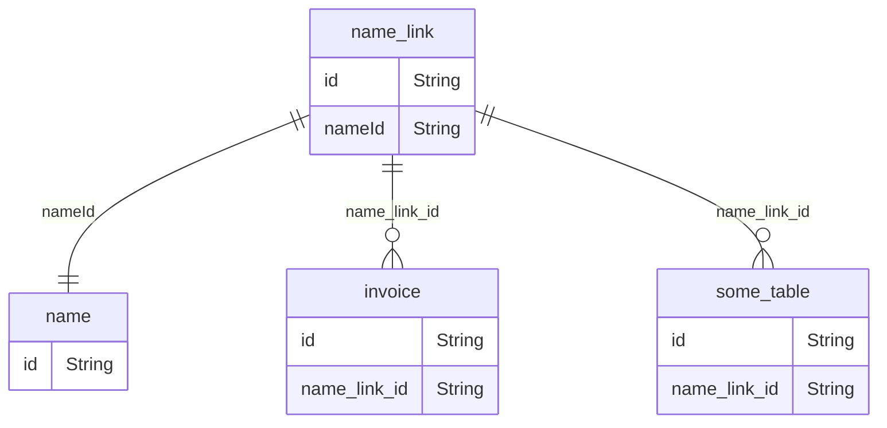

# Merging of Entities (e.g. Names or Items)

Two or more entities such as items or names may be merged after they have been created, e.g. because there are duplicates.
When merging two entities one entity is soft deleted while the second entity stays in the system and is not considered the "merged" entity.
Merging multiple entities can be achieved by recursively merging two entities till all entities are merged.

<!-- Links -->

One problem that occurs after a merge is that other table rows may still point to the soft deleted entity.
To solve this problem link tables are introduced and tables refer to these link tables instead of real entities.
For example,



<!-- Link creation -->

Links are created along with the entities they point to.
The initial id of a link is always the same as the entity id it points to, e.g.:

```rust
NameLink: {id: "new_name_id", name_id: "new_name_id"}
```

<!-- Merging links -->

When two entities are merged all link rows which point to the soft deleted entity needs to be updated to point to the new entity.
For example, when merging `"old_id"` into `"kept_name_id"`:

```rust
NameLink {id: "old_id", name_id: "old_id"}
NameLink {id: "previously_merged", name_id: "old_id"}
NameLink {id: "kept_name_id", name_id: "kept_name_id"}
```

becomes

```rust
NameLink {id: "old_id", name_id: "kept_name_id"}
NameLink {id: "previously_merged", name_id: "kept_name_id"}
NameLink {id: "kept_name_id", name_id: "kept_name_id"}
```

and all three links point to the same `"kept_name_id"`.

<!-- Links are repo only -->

In the code base, references to the link tables should be confined to the repository layer.
For example, querying an entity in the service layer must be done by `name_id` rather than by `name_link_id`.
Internally, the repository looks up all `name_links` which match the `name_id` and then uses these `name_links` to do the query.
Note, if a merge happened while the service layer still uses the id of the soft deleted entity, a query using this id will return nothing because there will be no links pointing to this old id.

<!-- Link abstraction using define_linked_tables! macro -->

## Entity Link Abstraction Pattern

To hide the internal `name_link_id` implementation detail from the rest of the codebase, we use the `define_linked_tables!` macro pattern. This pattern:

1. **Generates two table definitions:**
   - A **view table** (e.g., `invoice_view`, `requisition_view`) that exposes resolved `name_id` fields
   - A **core table with links** (e.g., `invoice_with_links`, `requisition_with_links`) that contains the actual `name_link_id` fields

2. **Struct uses resolved IDs:**
   The public struct (e.g., `InvoiceRow`, `RequisitionRow`) uses `name_id` instead of `name_link_id`:
   ```rust
   pub struct InvoiceRow {
       pub id: String,
       pub name_id: String,  // Resolved from name_link, not name_link_id
       // ... other fields
   }
   ```

3. **Automatic translation on upsert:**
   The macro generates an `_upsert()` method that automatically translates `name_id` to `name_link_id` when writing to the database:
   ```rust
   impl InvoiceRowRepository {
       pub fn upsert_one(&self, row: &InvoiceRow) -> Result<i64, RepositoryError> {
           self._upsert(row)?;  // Handles name_id -> name_link_id translation
           self.insert_changelog(row, RowActionType::Upsert)
       }
   }
   ```

4. **Query pattern with auto_type:**
   Queries use the `#[diesel::dsl::auto_type]` pattern for cleaner type inference:
   ```rust
   #[diesel::dsl::auto_type]
   fn query() -> _ {
       invoice::table
           .inner_join(
               name_link::table
                   .on(invoice_with_links::name_link_id.eq(name_link::id))
                   .inner_join(name::table.on(name_link::name_id.eq(name::id))),
           )
           .inner_join(store::table)
   }

   type BoxedQuery = IntoBoxed<'static, query, DBType>;
   ```

### Benefits

- **Cleaner API**: Service layer only sees `name_id`, never `name_link_id`
- **Type safety**: The macro ensures correct translation between view and core tables
- **Maintainability**: Join patterns are defined once and reused
- **Consistency**: All tables follow the same pattern (invoice, requisition, etc.)

### Migration considerations

When updating an entity, you should use `row.name_id = customer_name.id` because `customer_name.id` is guaranteed to have a corresponding `name_link` row.
For existing records you should **not** update `name_id` if it would break transfer logic. If you observe that the resolved `name_id` differs from the original, this is because the original name has been merged into the current name.
