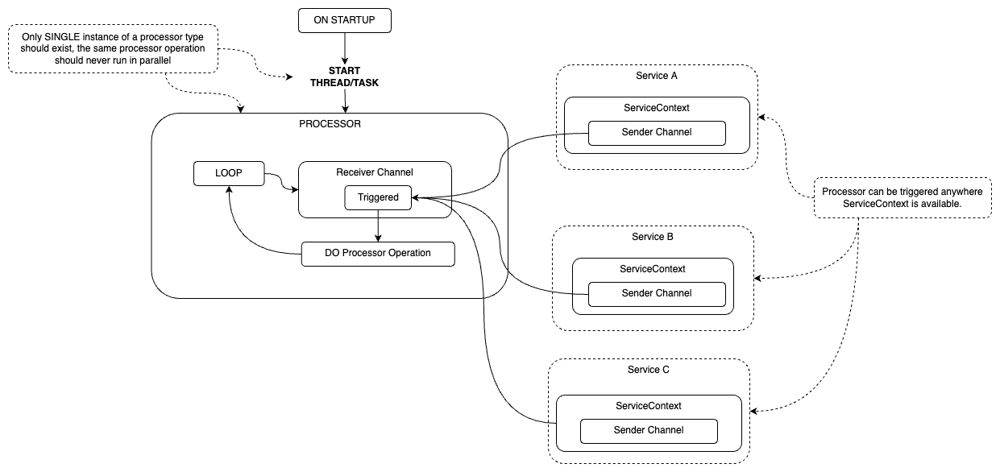

# Processors

Processors take actions based on events in the system. For example, when a requisition is received from a remote store via sync, a processor might automatically create a requision_response record based on this event. Usually they will rely on events generated by the changelog database table.

Diagram below describes a single processor. The concept of single processor is extended with processors driver by grouping multiple processors in on thread/task.

From [TMF internal google doc](https://app.diagrams.net/#G1KHIEK-PinYwflsAH4WP9fNvKL8U2POzX):



## Motivation

It is desirable to perform some operations syncrhonously as they may cause undesirable and unexpected side effects when run concurrently. These operations should be `triggerable` in services, wherever `ServiceContext` and `ServiceProvider` are available and should be `triggerable` on individual basis.

We can achieve this creating channels and spawning a task that listens to those channels. The senders for the channel can be put into Atomic Reference Counter (Arc) and passed along as a context to a service.

## Implementation

Channels are started via `Processors::init()`, and service provider takes the `Sender` part of the `Processors::init()` result tuple (`Sender` is already `Arc`ed). `Processors::spawn()` will start a task and return the `handle`. The task will wait on a message sent to trigger a particular processor and will invoke that processor.

The `handle` will need to be awaited in order for `processor` to work, in test this can be done with:

```rust
let test = || async move {
    // the test
};

tokio::select! {
    Err(err) = handle => unreachable!("{}", err),
    _ = test() => (),
};
```

## Extras

* Processor errors are currently logged and do not result in task throwing an error
* The only time processor handle will fail with an error is when a channel is closed (all of the receivers have been dropped), or on [JoinError](https://durch.github.io/rust-goauth/tokio/task/struct.JoinError.html)
* When triggering a processor, please keep in mind that you are only asking a processor to start (currently cannot await for processor to finish)

## TODO

* Current triggers do not await for the message to be sent, and do not await for the operation to be completed, this is potentialy desirable for processors after sychronisation and can be implemented with a more sophisticated messaging system. 

