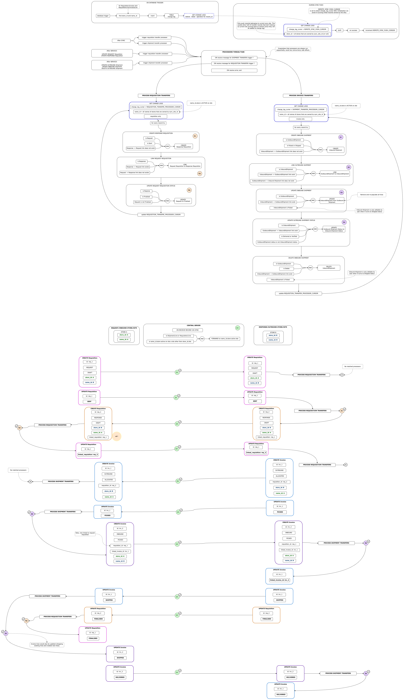

# Transfers

Pair records that belong to two different stores but are intrinsically linked together are called `transfers`:

`RequestRequisition` -> `ResponseRequisition`

`OutboundShipment` -> `InboundShipment`

The term `transfer` arrises from the need to `transfer` these records from one `sync site` to another, in a scenario where pair of linked transfer records belong to two different `sites`.

## Requirements

From [TMF internal google doc](https://docs.google.com/presentation/d/1eEe0uBGvkXbYnKc2oLO2U0qRwFv4l0ws4QwFZa6e74s/edit#slide=id.p):

Big difference between mSupply transfer requirements and omSupply:
* The inbound shipment part of the transfer is generate before outbound shipment is shipped (before inbound shipment is editable)
* Status updates on destinaton part of transfer (response requisition and inbound shipment) are reflected on source part of the transfer (request requisition and outbound shipment)

## Ownership

In our synchronisation system, we have a strong rule of:
* records can belong to **one** site only, which mean they can only be mutated on that site.

This means the `other half` of transfer record needs to be generated on the site that will own that record. This is done by processing `changelog` after syncrhonisation. 

## Changelog Processing

Each processor (`shipment` and `requisition` transfer processor) keep track of changelog it has processed, and when it's triggerd it will try processing any records that have been changed since the last processed changelog entry.

We **only** want to process shipments and requisitions that are `destined` for current site, thus changelogs are filtered by name_ids belonging to stores on that are active on current site.

## If both stores are active on current site

Same exact process is used, except the processors are triggered in services, see diagram below. This diagram doesn't quite show how records are `linked` using processors, explained in this example
* Request Requisition (id: A) is created and set to `sent` status
* Requsition Processor is triggered
* Processor sees new requisition in change log and executes `CreateResponseRequisitionProcessor` which creates Response Requisition (id: B) and links it to Request Requisition (requisition_id: A)
* Processor tries to process any sother change log (it re-quieries changelogs until result is empty), and sees newly created Response Requisition, and will executed `LikRequestRequisitionProcessor` and set's (requisition_id: B) for Request Requistion (id: A)

## Potential for Circular/Infinite processing

Any event driven system has a potential for infinite looping. Processor conditions are carefully crafted to avoid these scenarior, but there is a possibility of an edge case that hasn't been considered. Care should be taken when adding changes and review transfer processor code.

## Referential integrity

Having referential constraints in database means that at access time we dont' need to do extra checks, but referential constrains cause a slightly problem, for example `invoice_line` would be transfered from source site to destination site, but associated `stock_line` and `location` will not (as they would only exists on source site). This is metigated by incoming sync translator, if a record does not belong to current site both stock_line and location are set to null in database

## Diagram

From [TMF internal docs](https://app.diagrams.net/#G1o_xRQAhjVsnqhxhJEu9dY6AZ_lJfG9co)

## Integration tests

Transfer processor functionality tests are inculded in sync integration tests.

## TODO

* Any way to protect against infinite loop ? (Can potentialy identify that changelog is constantly growing within a processor loop), is there a way to test for it ?
