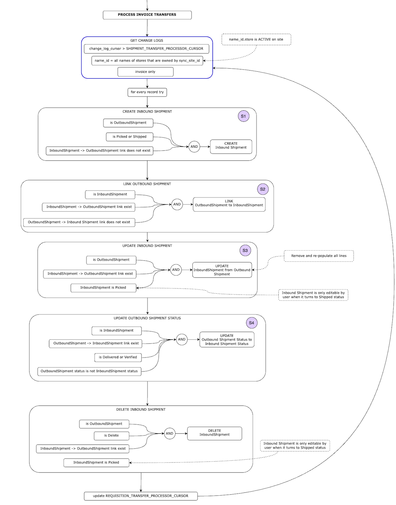

# Invoice Transfer Processor

As per general description in [transfer processors](../README.md) and these diagrams:

From [TMF internal google doc](https://docs.google.com/presentation/d/1eEe0uBGvkXbYnKc2oLO2U0qRwFv4l0ws4QwFZa6e74s/edit#slide=id.p):

From [TMF internal docs](https://app.diagrams.net/#G1o_xRQAhjVsnqhxhJEu9dY6AZ_lJfG9co)

Note that only Open mSupply -> Open mSupply transfers have a `linked_invoice_id` on the Outbound invoice. When transferring to/from an mSupply Desktop site, the Inbound invoice will have a `linked_invoice_id` (referring to the Outbound half), but the Outbound won't be linked back with its Inbound invoice.

## Request Requisition linked to Inbound Shipment

When an inbound shipment is created from outbound shipment, we check for a requisition linked to the outbound shipment (response requisition) and check which request requisition is linked to that response requisition and link the inbound shipment with correct request requisition

## Invoice Line on Update

When an outbound invoice is updated and an inbound invoice is already generated, invoice lines will be dropped and reinstated to match the outbound invoice (this is the simplest way to update potentially changed invoice lines)

## Same site transfer (both stores on same site)

You may want to refer to [requisition transfer docs](../requisition/README.md#same-site-transfer-both-stores-on-same-site) for example of how one instance of triggered processor can itself upsert records and process them in the next iteration

## Returns

Returns are invoices, with outbounds and inbounds, just the same as shipments. As such, they are transferred by the same processor. The flow is shown below:

### Related documents

Where shipments have a related Requisition (referring to the Requisition that the Outbound Shipment was generated from, or the Internal Order that an Inbound Shipment was received for), returns have an original Shipment.

This is either:

- the Inbound Shipment that an Supplier Return was created from
- the Outbound Shipment that an Customer Return is related to

When an Customer Return is generated from an Supplier Return, we check if that Supplier Return was created from an Inbound Shipment (i.e. does it have an `original_shipment_id`). If that Inbound Shipment has a linked Outbound Shipment, that Outbound Shipment will be set as the original shipment for our generated Customer Return.

Manually created returns don't have an original shipment.

In the UI, these are shown in the `Related Documents` section on the Return detail page.

Note that mSupply Desktop Supplier Return -> Open mSupply Customer Return won't have an original shipment. `original_shipment_id` is new in Open mSupply, and isn't populated by mSupply Desktop. Thus, there won't be any links in the `Related Documents` section when in Open mSupply when viewing the Customer Return.
