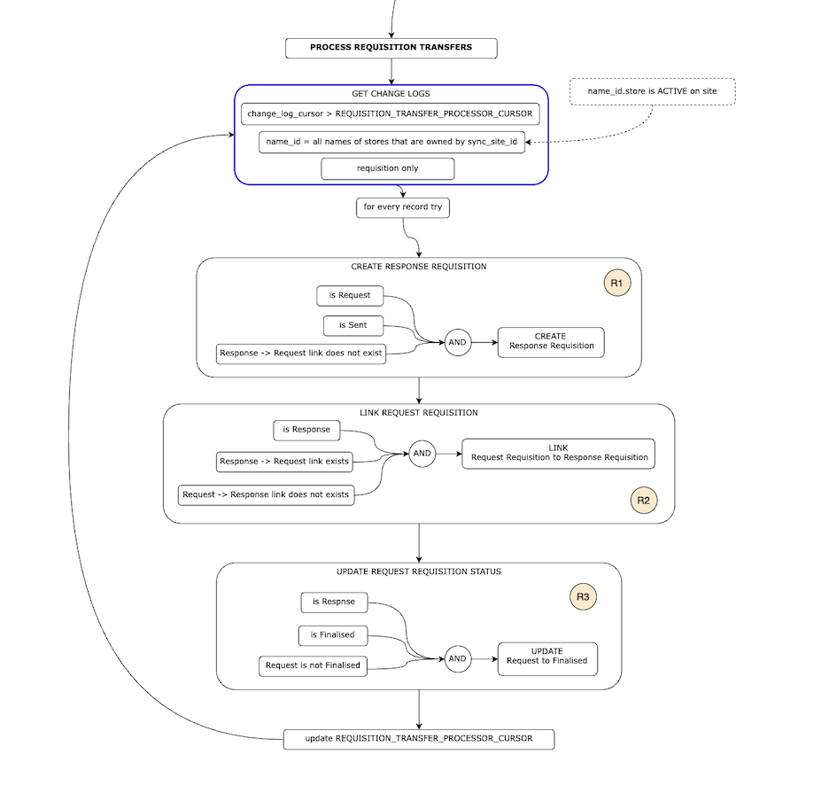

# Requisition Transfer Processor

As per general description in [transfer processors](../README.md) and these diagrams:

From [TMF internal google doc](https://docs.google.com/presentation/d/1eEe0uBGvkXbYnKc2oLO2U0qRwFv4l0ws4QwFZa6e74s/edit#slide=id.p):

From [TMF internal docs](https://app.diagrams.net/#G1o_xRQAhjVsnqhxhJEu9dY6AZ_lJfG9co)

## Same site transfer (both stores on same site)

This shows how one instance of triggered processor can itself upsert records and process them in the next iteration

