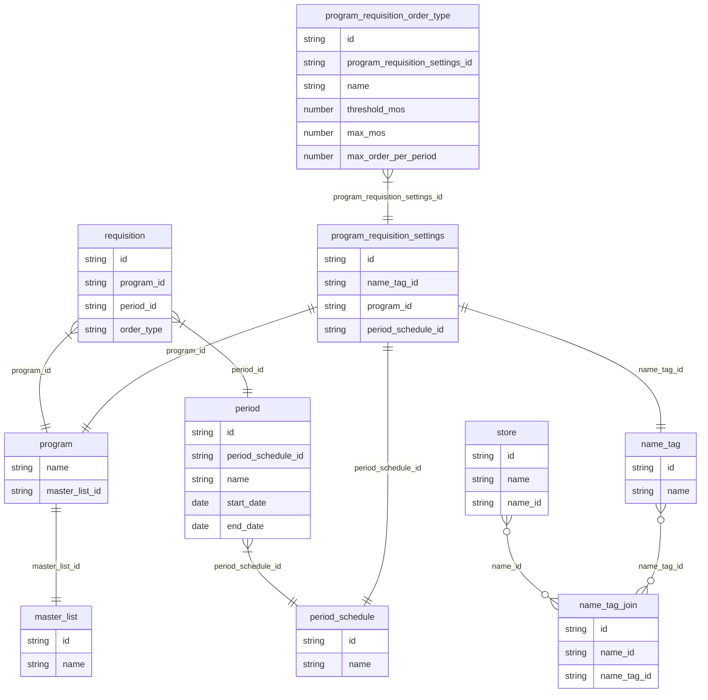

# Program Requisitions

Requisitions that can be configured to be restricted by program with certain parameters (period schedule, item list and associated programs, etc..) are called program requisitions. 

Programs (HIV, Malaria, Tuberculosis etc..) usually have a separate and more structured supply chain from general stock, program stock orders are meant to be pre-planned and are prescriptive. 

We can configure program restrictions at central server, then sync these settings to remote sites and restrict program orders based on these settings (in omSupply they are called **program settings**)

Different facility levels can order stock for the same program but have different configurations, i.e.

* Health Center will order from Regional Program Warehouse once a month (period schedule = monthly, max MOS = 1.5 month)
* Regional Program Warehouse will order from Central Program Warehouse one every 3 month (period schedule = quarterly, max MOS = 4 month)

Name tags are used to group and associate different program settings with stores

## Schema

Note: It's possible to delete program settings on central server, thus order_type (name) is saved against requisition, rather than saving program_requisition_order_type_id

## Restrictions

### Determining available programs, order types, periods and suppliers
The logic to calculate which program orders can be made for a given store (store A) is as follows:

Find all `program_requisition_settings` that are linked to store A through `name_tag` and through `master_list` visibility of program's master list. This determines all available program_settings and order types for those programs in store A.

To determine available periods for order type, we look at the period schedule for a give program setting, and then do a count for periods of that period schedule that have been used by requisitions of this program, this count is compared against `maxOrderPerPeriod` to deduce available periods.

And suppliers that can be selected for this program requisition are the ones that are visible in store A and also linked to the program's master list.

There are hard coded constants `MAX_NUMBER_OF_HISTORIC_PERIODS` and `MAX_NUMBER_OF_FUTURE_PERIODS` that determine how many periods are usable (this is based on current date and available periods for the order type).

### Program requisition edibility

When a program requisition is created, a master list item list is used (back end will auto insert those items). Existing program requisitions is restricted in edibility of:
* Items cannot be added or deleted
* Max MOS and Min MOS are not editable

Requisition is considered a program requisition when `program_id` field is not null.

## Sync

`name_tag`s, `name_tag_join`, `periods_schedule` and `period`s sync normally with straight forward translation.

`program_requisition_settings`, `program_requisition_order_type` and `program` require a complex translation that originates in `program_settings` json fields of a master list.

The basic program configuration json data looks like this: 

https://github.com/openmsupply/open-msupply/blob/34a30cf24fca36c4939949ce7e8e418936f4a15f/server/service/src/sync/test/test_data/program_requisition_settings.rs#L91-L111

When processing the master list for program settings `ProgramRequisitionSettingsTranslation`, we first drop all associated program requisition settings and program requisition order types. They are then re-populated (this is easier than trying to mutate existing settings to match new configuration).

Because we are turning json structure to a relational structure we need to decide on what ids to use for related rows.

**program**.id = id of master list
**program_settings**.name_tag_id = look up name tag by name and use it's id
**program_settings**.id = {id of master list}{id of name tag}
**program_settings**.period_schedule_id = look up period schedule by name and use it's id
**program_order_type_id**.id = {parent program settings id}{order type name}

## Extra

We calculate AMC and suggested quantity when program requisitions is created, and it's based on requisition creation date (as oppose to start_date of the period, this may need to be revised).
